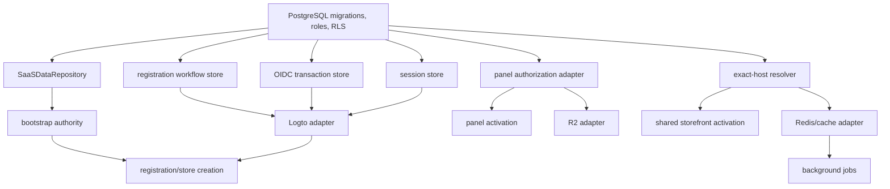

# Phase 2 Persistent Adapter Contracts

Status: implementation design only. No adapter, migration, database role, provider client, credential, or infrastructure resource is created by this document.

## Common adapter rules

All adapters import the frozen contracts and existing Phase 1 ports. They do not redefine `CreateStarterTenantInput`, `CreateStarterTenantResult`, `TenantContext`, `StoreMembership`, `PlanEntitlements`, or `ResolvedStoreHost`. Every public-path adapter is least privilege, fail-closed, bounded by timeouts, emits only safe errors, and accepts tenant identity only from server-established context.

### RLS security model

- Every tenant table uses `ENABLE` and `FORCE ROW LEVEL SECURITY`; runtime roles do not own tables or policies.
- Principal-only membership discovery requires `app.current_principal_id` and returns only that principal's active memberships.
- Store-scoped policies require both the selected `app.current_store_id` and an active membership joining the same `app.current_principal_id`; a store GUC alone never satisfies a policy. Role-sensitive writes add the required membership role/status predicate.
- `app.current_*` values are set with `SET LOCAL` only after server authentication and are repeated as parameters/conditional predicates in high-risk statements. Custom GUCs are routing context, not database authentication: they reduce accidental missing filters but cannot contain a stolen application credential that can issue arbitrary SQL. Therefore public adapters expose no generic SQL client/query helper, use fixed parameterized statements, isolate credentials/pools by service, and treat application-container credential compromise as a separately tested High/Critical threat.
- The host resolver starts before principal/store context exists and therefore receives only EXECUTE on a narrow read-only exact-host function returning the safe frozen projection; it has no table/list access.
- The isolated bootstrap role is the only approved BYPASSRLS role. Its explicit table/column grants, credential placement, statement inventory, and audit are tested independently below.

| Current port/interface | Production adapter | Durable authority |
| --- | --- | --- |
| `SaaSDataRepository` | PostgreSQL SaaS data repository | shared SaaS PostgreSQL |
| `RegistrationAttemptStore` + `RegistrationCompletionStore` | PostgreSQL registration workflow store | shared SaaS PostgreSQL |
| `OidcTransactionStore` | PostgreSQL OIDC transaction store | shared SaaS PostgreSQL, with encrypted sensitive fields |
| `OidcProviderPort` | server-only Logto OIDC adapter | exact Logto issuer/JWKS plus local transaction record |
| `PanelSessionStore` | PostgreSQL panel session store | shared SaaS PostgreSQL |
| `PanelAuthorizationDataPort` | PostgreSQL panel authorization adapter | principals, memberships, stores, subscriptions/plans/domains |
| `StoreDomainResolver` | narrow PostgreSQL exact-host resolver | active domain + active store records |
| namespace builders | R2, Redis/cache, and queue adapters | PostgreSQL store authority; storage systems hold scoped derivatives |

## 1. PostgreSQL `SaaSDataRepository`

**Interface implemented:** `packages/saas-data/src/ports.ts` `SaaSDataRepository` and all transaction repository ports.

**Source of truth:** the shared SaaS PostgreSQL database. The Phase 1 proposal SQL is design input, not an executable production migration.

### Transaction and isolation contract

- One `beginTransaction()` checks out one pool client and starts one PostgreSQL transaction. All principal, store, domain, membership, plan, subscription, setting, and tenant-operation work for a bootstrap uses that client.
- Required isolation is `READ COMMITTED`. This is deliberate: each statement receives a fresh snapshot, so a loser of a unique-key conflict can observe the winner after PostgreSQL waits for the winner to commit. Unique constraints and conditional updates, not preflight reads, arbitrate conflicts.
- `commit()` and `rollback()` are exactly-once terminal methods in the adapter. A terminal client is never reused by that transaction object.
- IDs are generated server-side with a reviewed UUID strategy; callers never supply authority IDs.
- `statement_timeout`, `lock_timeout`, and transaction duration are bounded. Proposed starting values are 5 seconds statement timeout, 2 seconds lock timeout, and 10 seconds total bootstrap deadline, calibrated by rehearsal.

### Atomic idempotency claim and winner visibility

The operation claim is the first data mutation in the same transaction that creates the tenant:

1. Attempt `INSERT ... ON CONFLICT (idempotency_key) DO NOTHING RETURNING` with status `processing` and the canonical fingerprint.
2. A returned row means exactly one caller is the creator.
3. No returned row means the insert waited for the conflicting transaction. Under `READ COMMITTED`, issue a **separate statement** to read the exact operation row. The separate statement is required for winner-row visibility.
4. If the winner rolled back, the insert can become the creator. If a row is visible, compare its fingerprint using exact bytes.
5. Same fingerprint + `committed` + valid `result_payload` returns the immutable committed snapshot with `replayed=true`.
6. Different fingerprint returns `idempotency_mismatch` and emits an audit event.
7. Visible `processing`, `failed`, malformed, or missing-result rows fail closed as `tenant_transaction_failed`; they are never used to run a second bootstrap automatically.
8. `markCommitted` uses `WHERE id = ? AND status = 'processing'`, writes all result foreign keys and the frozen `result_payload`, and requires exactly one updated row.

The creator inserts/updates all bootstrap rows, marks the operation committed, and commits once. Therefore no committed transaction may expose a processing operation without its tenant rows, and replay authority is the committed `result_payload`, not mutable current business rows.

### Rollback, errors, and unknown commit state

- Any failure before `COMMIT` rolls back every bootstrap row and operation claim.
- Constraint errors are classified by named constraint: slug, hostname, membership, active subscription, setting, identity, or idempotency. Unknown SQLSTATEs map to a safe retryable transaction failure; SQL text, parameters, and database identifiers are never returned.
- Serialization/deadlock retries are not expected under the selected isolation level. A narrowly classified deadlock before any commit attempt may be retried at most twice with jitter, using a fresh transaction and the same key/fingerprint.
- Connection, statement, pool checkout, and lock timeouts are distinct metrics. Pool checkout timeout never starts a bootstrap.
- If the client reports an error during or after sending `COMMIT`, the outcome is **unknown**. The adapter destroys that connection, emits `tenant_bootstrap_commit_unknown`, and does not blindly re-run the transaction.
- Controlled recovery uses a fresh connection and the same idempotency key: read the operation. Committed + matching fingerprint returns its snapshot; absent proves no commit and permits a separately authorized retry; processing/failed/mismatch is quarantined for operator review. The original request does not loop.

### Connection-pool behavior

- Separate pools/roles exist for tenant requests, host resolution, workflow/session operations, and bootstrap invocation. Public request code cannot borrow the bootstrap role.
- Pool size, queue length, checkout timeout, statement timeout, and transaction age are observable and bounded per process.
- Tenant adapters set `app.current_principal_id` and `app.current_store_id` with `SET LOCAL` inside a transaction. They never use session-level `SET`.
- A client is released only after successful commit/rollback; broken or unknown-state clients are destroyed. Pool release hooks verify no open transaction.
- Health checks use a non-sensitive fixed query and do not bypass RLS.

**Transactional guarantees:** all bootstrap rows and committed replay snapshot are atomic; database uniqueness decides all races; no partial tenant is visible.

**Fail-closed behavior:** no pool, timeout, unexpected row count, unknown SQLSTATE, malformed result, or unknown commit is interpreted as success.

**Required tests:** full repository-port conformance; named-constraint mapping; rollback fault injection after every write; same/different fingerprint races; slug/host/principal email races; pool exhaustion; timeouts; connection loss before and during commit; result-payload immutability; multi-process execution against real PostgreSQL.

**Production activation gate:** Phase 2A migration, least-privilege/RLS proof, disposable concurrency suite, backup/restore and rollback proof, and security approval all PASS.

## 2. Tenant bootstrap authority

**Source of truth:** the PostgreSQL operation row and tenant rows committed by the existing TypeScript Tenant Core orchestration through `SaaSDataRepository`. The workflow record and bootstrap credential are not commit authority.

### Preferred design: isolated internal bootstrap role with constrained `BYPASSRLS`

Use one dedicated workload role only in the internal Tenant Core process and pool. It has `BYPASSRLS` because bootstrap must create the operation before a store ID exists, but explicit schema/table/column grants restrict it to the exact shared-SaaS bootstrap reads and writes. It has no ownership, DDL, role administration, function creation, extension, database creation, other-schema, observability, workflow/session, or dedicated-store privileges. IDs remain generated in Tenant Core. The existing `SaaSDataRepository` transaction checks out this role's isolated client, begins/commits/rolls back the transaction, and invokes the existing method-oriented ports; orchestration is not duplicated or moved into SQL.

This is preferred because a PostgreSQL function cannot begin or commit its own transaction, and a single complete-bootstrap function would relocate the frozen `CreateStarterTenant` orchestration into SQL. The constrained role preserves the Phase 1 architecture boundary and adapter contract. Its residual blast radius—every row in the specifically granted bootstrap tables—is Critical and is controlled by process/pool isolation, column grants, fixed parameterized statements, workload authentication, short credential lifetime, network policy, rate/volume limits, audit, and a kill switch.

### Rejected design: one complete `SECURITY DEFINER` bootstrap function

A `SECURITY DEFINER` function would reduce direct table grants, but PostgreSQL functions execute inside the caller's transaction and cannot own `BEGIN`/`COMMIT`. Making one function perform the complete bootstrap would duplicate or move Tenant Core's frozen orchestration and repository behavior into SQL; splitting it into privileged per-method functions would expand the function surface and still require caller-owned transaction control. This design is rejected for Phase 2 unless Atlas separately approves a changed architecture boundary and a new contract/security review. Narrow `SECURITY DEFINER` functions remain acceptable for read-only exact-host resolution because that operation is already one bounded query and returns a frozen safe projection.

### Privilege matrix

| Role | Login | RLS bypass | Table rights | Function rights | Allowed caller |
| --- | --- | --- | --- | --- | --- |
| migration owner | no/runtime inaccessible | administrative only during migration | owns schema objects | manages definitions | migration pipeline only |
| bootstrap role | workload only, preferably short-lived | yes, isolated | explicit bootstrap tables/columns only | no function/DDL ownership | authenticated internal Tenant Core process and dedicated pool only |
| tenant application | workload only | no | scoped CRUD subject to RLS | none | panel/API requests |
| host resolver | workload only | no broad bypass | no table access or exact safe resolver function only | execute exact resolver | shared storefront |
| workflow/session service | workload only | no | specific workflow/session tables | no bootstrap | Owner/panel BFF |
| read-only observability | workload only | no | approved views only | none | monitoring jobs |

### Ownership, secrets, invocation, abuse controls, and audit

- Schema/table owners are `NOLOGIN`; the bootstrap role cannot alter schema objects, policies, grants, or role attributes.
- The repository uses parameterized fixed statements, named constraints, restrictive transaction-local timeouts, a dedicated connection pool, and an explicit query inventory. No generic query/export helper is exposed through the bootstrap adapter.
- The bootstrap credential is held server-side in the approved secret manager, rotated independently, never logged, and absent from browser, panel, storefront, generic worker, workflow/session, and public route containers. Prefer workload identity/short-lived credentials where supported.
- Invocation is only from the disabled-by-default internal Tenant Core route after service authentication and input validation. Network placement is defense in depth, not the authorization decision.
- Rate limits bind verified principal, safe attempt, IP risk signal, and idempotency key. Quotas block mass creation. Concurrent use of one key is expected; differing fingerprints are denied.
- Audit records capture bootstrap-role login, application/workload identity, request/operation/safe attempt/principal IDs, statement class, outcome, duration, and safe error code. Critical alerts fire on any connection from an unapproved workload/network, unexpected statement/table/column, fingerprint mismatch, abnormal store volume, grant drift, or use outside the internal route.

**Interface implemented:** the privileged persistence boundary behind `SaaSDataRepository`; no frozen contract changes.

**Transactional guarantees:** the existing repository/Tenant Core caller owns exactly one PostgreSQL transaction on one isolated bootstrap-role client and produces the immutable operation result.

**Fail-closed behavior:** missing privilege, wrong workload, pool/role mix-up, bad input, unexpected statement/row count, grant drift, or transaction uncertainty denies creation.

**Required tests:** catalog privilege/column-grant inspection; denial of DDL, role/policy/function changes, workflow/session/dedicated tables, and ungranted columns; pool separation; prepared-statement/injection inputs; RLS proof for normal roles; abuse/rate-limit and audit completeness; credential absence from public containers; compromised-public-handler and compromised-bootstrap-container blast-radius simulations.

**Production activation gate:** privilege matrix and repository query inventory reviewed by database/security owners; disposable proof shows the role can complete the frozen repository transaction but cannot act outside the exact bootstrap table/column set; Atlas explicitly accepts the residual BYPASSRLS risk.

## 3. Registration workflow store

**Interfaces implemented:** Owner `RegistrationAttemptStore` and panel `RegistrationCompletionStore` over one authoritative row.

**Source of truth:** PostgreSQL registration workflow table; no in-memory fallback after an attempt is accepted.

### Persistent record

Required columns/fields are:

- opaque attempt ID (primary key) and version/row number;
- keyed digest of OIDC state, never a recoverable state value after callback;
- immutable registration details: store name/slug, locale, currency, theme key, consent timestamps; no password and no raw full registration form;
- fixed `requested_at`, immutable idempotency key, verified identity snapshot (issuer, subject, normalized verified email), immutable Tenant Core input snapshot, canonical fingerprint, immutable tenant result snapshot, tenant operation summary, pending session snapshot/reference, safe error;
- status (`awaiting_identity`, `identity_verified`, `tenant_created`, `session_created`, `failed`), `expires_at`, `created_at`, `updated_at`, and optional terminal/retention timestamp.

Unique constraints cover attempt ID, state digest, and an HMAC digest of the idempotency key. Idempotency uniqueness is unconditional: a server-generated key is never reused for another attempt, including after terminal cleanup. The active row retains the bounded opaque key needed by the frozen Tenant Core input; cleanup removes it only after persisting a minimal non-PII tombstone containing the unique digest and terminal outcome. Snapshot JSON is schema-versioned and bounded.

### Atomicity, transitions, and recovery

- Insert is atomic and rejects duplicate attempt/state/key.
- Updates use optimistic locking: `WHERE id = ? AND row_version = ? AND status = ?`, incrementing the version. Zero rows means a stale writer and requires reload; it never overwrites the winner.
- Allowed transitions match Phase 1: awaiting identity -> identity verified/failed; identity verified -> tenant created/failed; tenant created -> tenant created/session created/failed; session created and failed are terminal/self-idempotent only.
- Immutable fields can be populated once where Phase 1 permits, then cannot change. Conditional updates and database checks enforce this in addition to adapter validation.
- Multi-instance callback/recovery races produce one transition winner. Losers reload and return the existing safe state; they do not call Tenant Core or create a second session unless the loaded state explicitly authorizes idempotent recovery.
- Public callback lookup is by one-time state and only status `awaiting_identity`. Recovery is by safe attempt ID **plus** a newly verified matching identity or authenticated matching principal; attempt ID alone is not authorization.
- Expired records are ineligible before mutation. Cleanup marks/expires first, then deletes sensitive snapshots after the approved troubleshooting period. Proposed retention: OIDC-linkable data 24 hours after terminal state; minimal audit IDs/outcome according to the audit retention policy.
- Cleanup is idempotent, batch-bounded, and cannot delete non-expired/in-progress records. Cleanup jobs use no wildcard tenant mutation.

**Transactional guarantees:** one authoritative record, atomic compare-and-swap transitions, one-time state ownership, immutable input/result snapshots.

**Fail-closed behavior:** conflict, expiry, version mismatch, illegal transition, malformed snapshot, or store outage denies callback/progression.

**Required tests:** all Phase 1 workflow tests against PostgreSQL; callback races across processes; immutable-field mutation; expiry boundary; cleanup/active race; recovery by wrong identity/principal; cookie serialization failure recovery; tenant-result replay; database restart.

**Production activation gate:** persistent adapter and multi-instance recovery suite PASS; PII/retention review approved; registration remains disabled until OIDC/session dependencies pass.

## 4. OIDC transaction store and Logto adapter

### Persistent OIDC transaction store

**Interface implemented:** Owner `OidcTransactionStore`.

**Source of truth:** the PostgreSQL OIDC transaction row for one-time state status and bound protocol parameters; the encryption key manager is authority only for verifier decryption keys.

The record contains a keyed digest of state, nonce, envelope-encrypted PKCE verifier, exact redirect URI, exact issuer, expected audience, approved return path, created/expiry timestamps, consumed timestamp/status, encryption key ID, and a minimal safe failure/retention marker. Raw state is held only by the browser/authorization redirect for its short lifetime; it is hashed for lookup. Nonce and verifier are never logged.

`consume` is one atomic conditional update returning the row only when the digest matches, `consumed_at IS NULL`, and expiry is in the future. A second consumer receives `oidc_state_replayed`; expired state receives a controlled expiry error. Consumption occurs before provider exchange. If exchange then fails, the authorization flow restarts rather than reusing state.

The verifier uses authenticated envelope encryption with key ID and associated data bound to state digest, redirect URI, and issuer. Database-at-rest encryption alone is insufficient because a database reader must not trivially recover active verifiers. Old encryption keys remain decrypt-capable only through maximum transaction lifetime plus a short incident buffer. Active transactions are retained no longer than 10 minutes; consumed/expired rows retain only digest and safe metadata for up to 24 hours, then are deleted.

**Transactional guarantees:** one successful consume globally across all instances; save and discard are idempotent only as specified by Phase 1.

**Fail-closed behavior:** decryption failure, wrong key ID, duplicate state, expiry, replay, or database outage stops callback before provider exchange.

**Required tests:** simultaneous consume, expired/consumed races, encryption tamper, key rotation overlap, callback duplicates, exact redirect/issuer/audience, restart across replicas, and redaction scanning.

**Production activation gate:** encryption/key lifecycle and one-time consume proof approved; no real provider is enabled before this gate.

### Real Logto OIDC adapter

**Interface implemented:** server-only `OidcProviderPort`.

- Discover metadata only from the pinned HTTPS issuer; reject issuer drift and insecure/local endpoints outside explicit test mode.
- Build Authorization Code requests with exact callback, `response_type=code`, nonce, state, PKCE S256 challenge, and the approved scopes. Never send the verifier in the authorization request.
- Exchange the code server-side. Validate signature with issuer JWKS, algorithm allowlist, exact issuer, required audience/client ID, expiry/not-before with bounded skew, nonce, subject, and verified-email claim.
- Cache JWKS by HTTP cache policy with bounded maximum TTL and safe refresh on unknown key ID; do not disable signature verification on fetch failure.
- Treat provider email/name as metadata. Persist principal authority only as issuer+subject.
- Logout revokes the local session first. Provider logout uses a fixed allowlisted post-logout redirect and never substitutes a caller URL.
- Provider errors map to safe codes; tokens and provider response bodies are never logged or returned.

**Source of truth:** Logto for signed identity assertion; local PostgreSQL for one-time transaction, principal mapping, membership, and session.

**Transactional guarantees:** the provider exchange occurs only after one durable atomic state consume; provider success does not create local authority until the workflow/session/database transitions commit. There is no distributed transaction with Logto, so recovery starts a new authorization rather than replaying consumed protocol state.

**Fail-closed behavior:** metadata/JWKS outage, invalid token/claim, redirect mismatch, provider timeout, or ambiguous callback produces no verified identity, tenant, or session.

**Required tests:** fake issuer/JWKS with key rotation; wrong issuer/audience/algorithm/nonce; expired/not-yet-valid token; PKCE downgrade; duplicate callback params; exact callback and logout redirects; provider timeout; token/error redaction.

**Production activation gate:** separate staging Logto application, secret rotation rehearsal, callback/logout tests, and identity security sign-off PASS.

## 5. Panel session store

**Interface implemented:** `PanelSessionStore` without changing the Phase 1 session contract.

**Source of truth:** PostgreSQL session table. The cookie contains a 256-bit random opaque ID. The database stores only an HMAC-SHA-256 lookup digest and key ID, never the raw ID.

Required fields are session digest/key ID, principal ID with issuer+subject authority binding, optional active store ID, created/rotated/last-seen/expires timestamps, revoked timestamp/reason, replacement-session digest for audit only, device-safe metadata if approved, and row version. No provider token is stored in the panel session.

### Lifetime and behavior decisions

- Absolute maximum lifetime remains 8 hours from `created_at` and is never extended by rotation.
- Idle timeout is 30 minutes. `last_seen_at` may be advanced at most once per 5 minutes with a conditional update to reduce write load; an expired idle window denies before refresh.
- Multiple devices are allowed, capped initially at five active sessions per principal. Creating a sixth revokes the oldest. Per-device logout revokes one session; password/account-security or operator action can revoke all principal sessions.
- `create` inserts one unique digest. `read` checks digest, revocation, idle timeout, absolute expiry, canonical timestamps, principal status, and safe shape.
- Rotation is one transaction: lock old row, verify active, insert new digest with original `created_at`/absolute expiry, revoke old row, commit. Concurrent rotations yield one winner; all old cookies fail after commit.
- Active-store rotation first re-queries current membership, then commits new session. Every tenant-aware request revalidates membership and active store; session data is not sufficient authority.
- Logout revokes durable state before clearing the cookie. If revocation persistence fails, return retry-required and do not imply success.
- Invalid or malformed sessions are revoked/destroyed when a safe digest exists; raw invalid cookie material is never logged.
- Revoked/digest records remain at least until absolute expiry plus clock-skew/incident buffer so replay can be denied across replicas.

**Transactional guarantees:** atomic rotation, durable revocation, unique digest, bounded multi-device count.

**Fail-closed behavior:** unavailable store, malformed row, expiry, revocation, stale rotation, or principal mismatch yields unauthenticated and clears/revokes where safe.

**Required tests:** multi-process create/read/revoke; rotation race; active-store race; idle/absolute boundary; clock skew; five-device cap; revoke-all; database restart; old-cookie replay; membership revocation during request.

**Production activation gate:** session concurrency, revocation, multi-instance, cookie, and incident-recovery gates PASS before OIDC login.

## 6. Panel authorization data adapter

**Interface implemented:** `PanelAuthorizationDataPort`.

**Source of truth:** PostgreSQL principals, memberships, stores, plans/subscriptions, and domains. Email is never queried to grant access.

1. Resolve the session principal by stored principal ID and require exact stored issuer+subject equality with the session authority.
2. In a transaction, `SET LOCAL app.current_principal_id` from that authenticated record and discover active memberships through principal-read RLS.
3. Select active store from current memberships; a browser/store session value is only a hint.
4. `SET LOCAL app.current_store_id` to the selected authoritative membership store ID.
5. Read principal authority, selected active membership/store, current active subscription/plan features/limits, and optional active canonical host through one joined statement so the projection uses one statement snapshot.
6. Re-check membership status before producing `TenantContext`. For high-risk writes, lock the selected membership row and condition the mutation on active membership.

Read-only context construction uses one joined SQL statement at `READ COMMITTED` after principal membership selection. High-risk mutations lock the selected active membership row `FOR SHARE` and perform the store-scoped mutation in the same transaction; membership revocation updates require the conflicting row lock, so PostgreSQL orders revoke-before-write (deny) or write-before-revoke rather than allowing an unobserved mixed state. Missing settings/limits/features deny. RLS variables are transaction-local and the pool role cannot bypass RLS.

**Transactional guarantees:** one request receives a self-consistent authority view sufficient for its operation; mutations bind store and active membership in SQL.

**Fail-closed behavior:** no principal, no active membership/store/subscription, mismatch, stale role, RLS denial, or pool failure returns a safe denial.

**Required tests:** email-change race, membership revoke during read/write, store suspension, entitlement expiry/update, forged active store, stale pooled context, RLS direct-query isolation, and multiple replicas.

**Production activation gate:** principal discovery and store-scoped RLS matrices PASS for every role and operation.

## 7. Production `StoreDomainResolver`

**Interface implemented:** `StoreDomainResolver.resolveExactHostname(normalizedHostname)`.

**Source of truth:** PostgreSQL domain and store rows; cache entries are derivatives.

- Accept only a hostname already normalized by the Phase 1 trusted-host parser; revalidate exact normalized equality and reject IP/local values outside explicit tests.
- Perform an exact equality lookup. Require exactly one active domain joined to one active store.
- Return only frozen `ResolvedStoreHost` safe fields: domain ID/type, exact hostname, store ID/slug, canonical hostname, active status, and cache version.
- For a canonical record, require the canonical hostname equals itself and it is the store's unique active canonical domain.
- For an alias, return its database-derived canonical hostname. The existing runtime performs a required second exact lookup; that canonical record must be active, self-canonical, and bound to the same store ID and slug.
- There is no wildcard, suffix, slug, first-row, or default fallback. Ambiguity and data-shape violations fail closed.
- The resolver role has only EXECUTE on a narrow safe resolver function/view boundary; it is not a global service-role client.

Positive cache entries are keyed by exact normalized hostname and cache version with a proposed 60-second maximum TTL. Negative cache entries store only a denial code for at most 15 seconds; they are never created on database timeout. Domain/store changes publish a transactional outbox event after commit; consumers evict the exact hostname, canonical hostname, and store-version entries. If invalidation is unhealthy, bypass or shorten cache rather than serving beyond the safe TTL.

Custom-domain lifecycle is `pending_verification` -> proof challenge issued -> DNS/HTTP proof observed repeatedly from approved resolvers -> ownership recorded -> TLS readiness confirmed by the separately approved infrastructure process -> `active`. Ownership changes, proof loss, store suspension, or conflict transition to disabled/pending and invalidate caches. Domain claiming is rate-limited and entitlement/quota checked. No DNS or TLS action is part of this plan.

**Transactional guarantees:** resolver output is derived from one exact consistent query; activation and outbox invalidation commit together.

**Fail-closed behavior:** invalid/unknown/ambiguous/pending/disabled host, inactive store, alias mismatch, cache uncertainty, or database error returns no tenant.

**Required tests:** exact and Unicode normalization; suffix attacks; same hostname/different store race; alias/canonical update race; suspended store; cache poisoning/version/invalidation; custom-domain claim conflict; replica consistency.

**Production activation gate:** exact-host, cache, custom-domain proof, and unknown-host tests PASS; only allowlisted synthetic hosts can be enabled first.

## 8. R2 adapter

**Interface implemented:** a new server-only tenant media port under the Agent C boundary, consuming `TenantContext.store.id` and the existing `buildStoreObjectKey` helper.

**Source of truth:** PostgreSQL media metadata/authorization; R2 holds bytes under an enforced tenant prefix.

- Every key is adapter-generated as `stores/{store_id}/{kind}/{server_generated_id}.{safe_extension}`. User filenames are metadata, not object paths.
- Validate declared MIME, allowed extension, magic bytes, maximum size, image dimensions/decompression limits, malware policy, and current storage entitlement before making an object visible.
- Upload signed URLs permit one exact generated key, method, content type, size bounds, and short expiry; download URLs are short-lived and issued only after authorization. Bucket credentials and broad list operations never reach clients.
- Delete requires current membership/role, media-row ownership, exact store prefix, and conditional version/ETag where applicable. It is idempotent and audited.
- Copy/move requires both source and destination metadata to resolve to the same authoritative store. Cross-store server-side copy is forbidden; approved import re-uploads through a separately audited workflow.
- Alt text and original filename are bounded/normalized metadata stored in PostgreSQL; they never affect the key or response headers unsafely.
- Listing always begins from a store-scoped metadata query or exact prefix and cannot enumerate bucket root or another `stores/` prefix.

**Transactional guarantees:** metadata uses pending -> ready/failed state; object visibility follows successful validation; cleanup is compensating and idempotent because PostgreSQL and R2 cannot share a transaction.

**Fail-closed behavior:** missing context, unsafe path/MIME, quota uncertainty, prefix mismatch, stale metadata, or R2 error denies/marks failed without cross-store fallback.

**Required tests:** traversal/encoding/prefix escape, spoofed MIME/polyglot, huge image, signed URL scope, cross-store list/read/delete/copy, failed upload cleanup, quota race, and audit redaction.

**Production activation gate:** synthetic-bucket isolation and cleanup proof, quota/security review, and R2 gate PASS. No real R2 access occurs in this planning task.

## 9. Redis, cache, and job adapter

**Interfaces implemented:** production wrappers around the Phase 1 cache/tag/job namespace builders plus a versioned queue envelope.

**Source of truth:** PostgreSQL for tenant/business state and job operations; Redis/queue is coordination and delivery only.

- All APIs accept authoritative `storeId` plus structured segments; no API accepts a caller-composed full Redis key.
- Keys include environment, schema version, store ID, subsystem/resource, and cache/domain version. Example shape: `celebix:{env}:v1:{store_id}:{subsystem}:{key}:v{namespace_version}`.
- Tags/invalidation include one exact store ID and resource/version. Cross-tenant wildcard deletion, `KEYS`, pattern scans, and unbounded tag fan-out are forbidden.
- Positive cache payloads are schema-versioned and validate embedded store ID. Negative entries use short TTL and safe denial only. Entitlement, membership, domain, and store status use conservative TTLs and transactional outbox invalidation.
- Distributed locks are used only for optimization/single-flight, never correctness. They have random owner tokens, bounded lease, compare-and-delete release, fencing token where a stale holder could write, and no unbounded wait.
- Queue payload schema requires `schemaVersion`, `jobId`, `storeId`, `kind`, `idempotencyKey`, `attempt`, `createdAt`, and bounded safe payload. Producers derive `storeId` from server context.
- Worker claims are durable/idempotent in PostgreSQL with a unique store-bound job key. At-least-once delivery is assumed. Retries use exponential backoff with jitter and a per-kind maximum (initial proposal: five attempts); permanent authorization/schema errors are not retried.
- Exhausted jobs enter a tenant-bound dead-letter queue containing safe identifiers and error code only. Replay requires operator authorization, current store/entitlement validation, and the original idempotency key.
- Cache/job Redis ACLs are environment-specific and cannot access session or rate-limit namespaces unless explicitly required.

**Transactional guarantees:** cache may be stale only within approved TTL; outbox ties invalidation/job publication to the database commit; job side effects are idempotently claimed.

**Fail-closed behavior:** missing store ID, key mismatch, malformed payload, stale schema, revoked entitlement, lock uncertainty, or Redis outage bypasses cache/pauses work rather than crossing tenants.

**Required tests:** key collisions, malicious store IDs, wildcard attempts, payload store mismatch, stale cache after domain/membership change, lock expiry/fencing, duplicate delivery, retry exhaustion, DLQ replay, and multi-worker races.

**Production activation gate:** Redis ACL/namespace tests, outbox recovery, job idempotency/DLQ, cache invalidation, and tenant isolation matrix PASS. No Redis or queue action occurs in this planning task.

## Adapter activation dependencies

