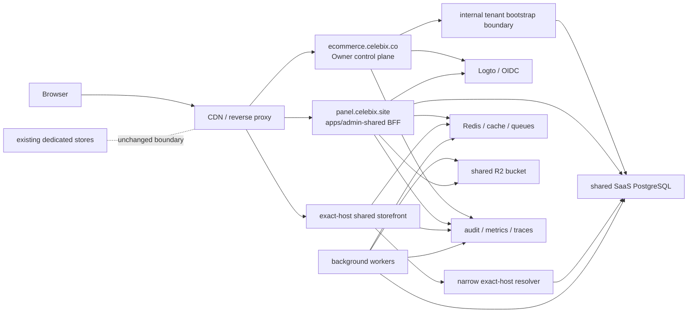
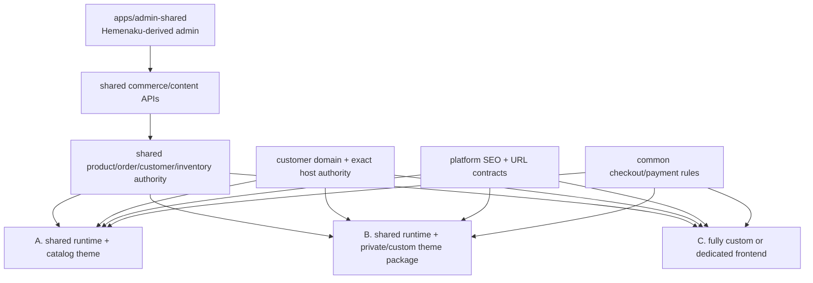
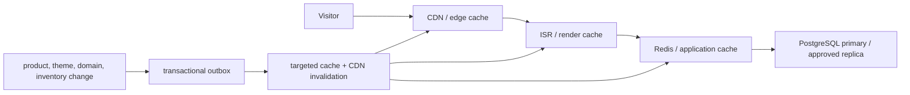
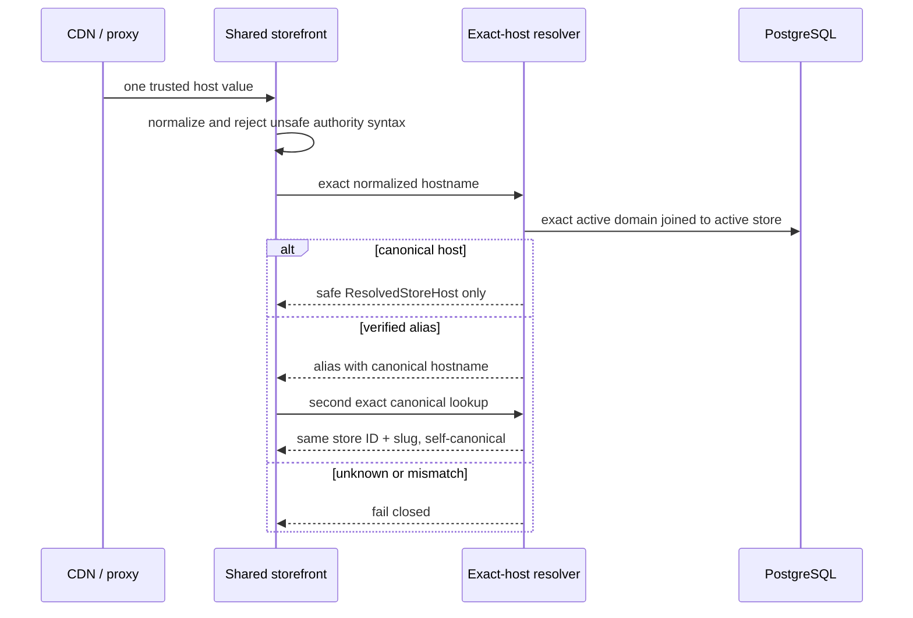
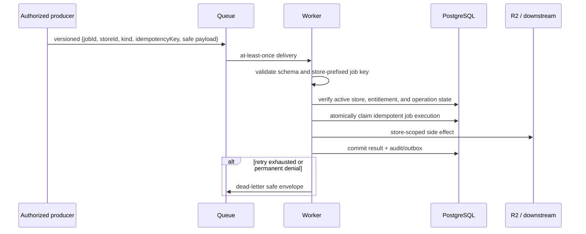

# Phase 2 Shared SaaS Target Architecture

Status: planning only; staging readiness is **NOT READY**. This document authorizes no deployment, database connection, migration execution, identity-provider configuration, DNS/TLS change, or feature activation.

## Source-of-truth audit

Phase 2 starts from `main` at `bfd07e1c4afffee4fdbcd7202549f14227fe601e`, the merge commit for PR #27. The frozen contracts in `packages/saas-contracts`, the ports in `packages/saas-data`, Tenant Core, registration/OIDC/session ports, exact-host storefront runtime, integration tests, and `docs/architecture/saas-implementation-boundaries.md` remain authoritative.

The audit found these boundaries:

| Area | Phase 1 authority | Phase 2 requirement |
| --- | --- | --- |
| Tenant creation | `CreateStarterTenant` and `SaaSDataRepository` ports; in-memory transaction | PostgreSQL implementation with atomic idempotency, RLS, and a narrow bootstrap authority |
| Registration | immutable workflow snapshots and guarded status transitions; in-memory stores | shared persistent workflow and OIDC transaction records safe across replicas |
| Sessions | opaque IDs, secure cookie policy, rotation/revocation ports; in-memory store | hashed persistent sessions with atomic rotation and immediate revocation |
| Panel authorization | issuer + subject principal authority, active membership, active store, entitlements | transaction-scoped PostgreSQL adapter and membership revalidation per request |
| Storefront | normalized exact-host resolver port; in-memory resolver; default runtime returns 503 | narrow exact-host database resolver, bounded caches, and verified custom-domain lifecycle |
| Namespaces | strict store-prefixed R2, cache, tag, and job key builders | production adapters that accept only server-established `store_id` |

Security properties currently proven only in one process include registration/OIDC single-use state, workflow immutability, session rotation, tenant-operation serialization, and cache/store namespace isolation. PostgreSQL concurrency, pool hygiene, replica-to-replica behavior, unknown commit state, queue delivery, and distributed invalidation remain unproven.

### Phase 1 disabled-state and undefined authority

At the audited base, `SELF_SERVE_SAAS_REGISTRATION_ENABLED` and `CUSTOMER_PANEL_AUTH_ENABLED` are hard-coded false; the internal Tenant Core route is disabled with an unavailable adapter; the customer-panel logout/callback uses disabled stores; and the shared storefront has no default resolver and returns a controlled 503. Store creation, provisioning, and auto-provisioning default false, while persistence defaults to the safe memory path unless explicitly selected under Phase 1 safety conditions. PR #27 records that no production adapter or deployment was activated, and `origin/deploy/owner` remains outside the Phase 1 main merge.

Infrastructure authority intentionally remains undefined in Phase 1: PostgreSQL provider/version/region and migration executor; runtime/database role issuer; backup/restore owner and objectives; workload identity and secret manager; CDN proxy-trust configuration; Redis/queue/R2 provider and account boundaries; staging Logto tenant/application; DNS/TLS/custom-domain verifier; observability vendor/retention; and production on-call. Phase 2 assigns required decisions and gates but does not choose accounts, read credentials, or mutate any resource.

## A. System topology

- `ecommerce.celebix.co` is the super-admin/control plane. It owns self-serve entry, internal tenant bootstrap invocation, support/audit workflows, and control-plane feature gates.
- `panel.celebix.site` is the shared customer-admin BFF served by the future `apps/admin-shared`, a Hemenaku Admin derivative that incorporates the Phase 1 `apps/customer-panel` security foundations. Browser code never receives provider or database credentials and never constructs tenant authority.
- `{slug}.celebix.site` is the shared platform storefront. Verified custom domains may resolve to the same runtime only after exact ownership verification.
- A separate shared SaaS PostgreSQL database is the authority for principals, stores, domains, memberships, plans, subscriptions, settings, tenant operations, registration workflows, OIDC transactions, sessions, and an outbox where required.
- A shared Redis/cache/queue layer provides bounded caching, distributed coordination, rate limits, and job delivery; PostgreSQL remains the durable authority.
- One shared R2 bucket stores objects only under `stores/{store_id}/...`.
- Logto is the OIDC identity provider. One server-side application uses the exact callback `https://panel.celebix.site/auth/callback` and Authorization Code + PKCE S256.
- Background workers consume store-bound jobs and re-authorize the store, entitlement, and job type before side effects.
- Existing dedicated stores, their admin/storefront applications, data, provisioning, and deployment remain separate and unchanged.



### Staging topology

Staging must use an isolated hostname set, separate PostgreSQL instance/database and roles, separate Redis namespace or instance, separate R2 bucket, separate queue topics, separate OIDC application, and separate observability dataset. It must contain synthetic data only. No staging credential may reach production and no production hostname may route to staging.

## Approved product architecture

Celebix is a Shopify + ikas hybrid: Shopify-like theme/domain/extensibility, ikas-like onboarding and operational simplicity, a Hemenaku-derived mature shared admin, and shared-first infrastructure with objective dedicated escalation. These are Phase 2 architecture constraints, not optional enhancements.

### Product principles

- Product, inventory, order, customer, content, and entitlement data is independent of presentation themes.
- Changing, publishing, rolling back, or replacing a theme never changes product/order authority.
- SEO-critical behavior belongs to platform core, not theme packages.
- Every published eligible page must be technically crawlable and indexable. Search-engine discovery, crawling, ranking, and indexing outcomes cannot be guaranteed.
- One tenant may not consume unlimited shared compute, connections, queues, media processing, storage, or bandwidth.
- Checkout, stock, order, and payment traffic has higher priority than reports, imports, exports, analytics, and other bulk/admin workloads.
- Catalog, private-theme, and fully custom frontends remain compatible with the same shared admin and commerce backend.
- Dedicated infrastructure is an escalation path, not the default, and a dedicated frontend does not imply dedicated data.
- Existing Hemenaku and other dedicated stores/admins remain untouched until separately approved.
- All production flags remain disabled; this document performs no activation.

### Hemenaku Admin donor and shared-admin decision

The target customer-admin application path is **`apps/admin-shared`**. It will be a safe, independently built and deployed derivative of the mature Hemenaku Admin product currently represented by the read-only `apps/admin` donor. `apps/customer-panel` remains the Phase 1 reference/foundation for OIDC callback, persistent session, membership, active-store selection, request security, and `TenantContext`; those foundations move into `apps/admin-shared` rather than growing a separate minimal panel product. This Atlas correction fixes the target path; before implementation, the Integration Lead must record the corresponding ownership-path amendment in a separately approved boundary change, while the frozen contracts themselves remain unchanged.

This choice preserves Hemenaku's product, variant, collection, order, customer, discount, content, settings, analytics, and operational UX while giving the multi-tenant derivative a clean ownership/deployment boundary. No Phase 2 work mutates the live Hemenaku deployment, its database, environment, domains, logos, or dedicated admin. Donor code is copied/refactored only through a parity, tenant-adaptation, and security review; there is no runtime import or database coupling back to Hemenaku.

The shared derivative must remove the donor's build-time `STORE_SLUG`/registry selection, `NEXT_PUBLIC_*` single-store values, direct global Supabase/service-role clients, store-specific domains/defaults/branding, hardcoded logo and product/category copy, direct R2/Redis/provider access, and profile-role assumptions. Every product, variant, category, collection, brand, inventory, order, customer, promotion, media, content, settings, payment, shipping, report, staff, and theme API must derive authoritative `store_id` from the server session/membership `TenantContext` and enforce role/entitlement/quota policy.

### Mandatory Hemenaku donor audit classification

Phase 2F must produce file-level evidence for this initial module classification before copying code:

| Donor module | Initial classification | Shared derivative rule |
| --- | --- | --- |
| UI primitives, tables, dialogs, editors, layout patterns | reusable unchanged | copy only presentation-only components with no environment, auth, data, or branding import |
| products | reusable after tenant adaptation | preserve list/create/edit/bulk UX; replace Supabase/global clients with store-bound ports, pagination, brand/inventory/SEO authority |
| variants | reusable after tenant adaptation | preserve attribute/SKU/price UX; bind product/store, inventory concurrency, and bounded bulk operations |
| categories | reusable after tenant adaptation | preserve hierarchy/management UX; add store-scoped IDs, pagination, SEO and redirect contracts |
| collections | reusable after tenant adaptation | preserve curated/automatic collection concepts after store-scoped rules, query budgets, and SEO adaptation |
| brands | unsafe donor code requiring replacement | replace default-brand/env assumptions with first-class tenant-scoped brand authority |
| inventory and bulk stock | reusable after tenant adaptation | bind warehouse/SKU/store, optimistic concurrency, quotas, and checkout-priority protection |
| orders and abandoned carts | reusable after tenant adaptation | preserve operational UX; use shared order authority, safe state machine, pagination, and role checks |
| customers and segments | reusable after tenant adaptation | tenant-scope all PII/search/export and apply privacy/audit limits |
| discounts and promotions | reusable after tenant adaptation | tenant-scope rules, counters, schedules, and entitlement enforcement |
| media UI | reusable after tenant adaptation | replace direct R2/global asset paths with the tenant media adapter |
| content, pages, policies, and blog | reusable after tenant adaptation | store-scoped drafts/publication, platform SEO metadata, safe rich text |
| settings UX | Hemenaku-specific and configurable | replace store-runtime/env defaults with typed tenant settings and platform-owned policies |
| payment configuration | unsafe donor code requiring replacement | retain UX concepts only; use tenant-scoped encrypted provider configuration and central webhook authority |
| shipping | Hemenaku-specific and configurable | retain carrier/rate UX after tenant-scoped adapter and state-machine review |
| reports and analytics | reusable after tenant adaptation | require store filters, query budgets, asynchronous exports, workload class, and privacy controls |
| staff and roles | unsafe donor code requiring replacement | replace Supabase `profiles` and hardcoded donor roles with shared principal/membership/role authority |
| theme entry points: hero, promotion banner, marquee, typography | reusable after tenant adaptation | map to versioned theme schema/settings; donor pages are not the theme platform itself |
| Hemenaku constants, domains, logos, support/default brand | Hemenaku-specific and configurable | remove compile-time authority; load bounded tenant branding from context/settings |
| direct APIs and database bindings | unsafe donor code requiring replacement | no direct service-role/global Supabase client; use tenant-aware server ports and fixed queries |
| build-time store registry, `STORE_SLUG`, `NEXT_PUBLIC_*`, default-store, and one-deployment/one-DB assumptions | unsafe donor code requiring replacement | request/session `TenantContext` and shared adapters establish store authority at runtime; no env-selected tenant |
| seed/migrate/test-payment endpoints and storefront/cart components inside `apps/admin` | Hemenaku-specific and excluded | do not copy into the shared admin runtime; replace with separately owned tools/services if approved |

The final audit inventory must explicitly cover products, variants, categories, collections, brands, inventory, orders, customers, discounts/promotions, media, content/pages/blog, settings, payment configuration, shipping, reports/analytics, staff/roles, theme entry points, and every Hemenaku-specific constant, domain, logo, API, database binding, and single-store assumption.

## Theme platform and onboarding

Theme selection is part of onboarding, before identity verification and tenant creation:

```mermaid
flowchart LR
  Name["Store name"] --> Slug["Slug"] --> Industry["Industry"]
  Industry --> Catalog["Theme catalog"] --> Preview["Theme preview"]
  Preview --> Select["Theme selection"] --> Brand["Logo + basic branding"]
  Brand --> Verify["Identity verification"] --> Create["Tenant creation"]
  Create --> Assign["Atomic store-theme assignment"] --> Admin["Hemenaku-based shared admin"]
```



Before identity exists, catalog preview is an anonymous, noindex demo rendered only from the certified immutable `preview_asset`/theme version and a fixed synthetic demo catalog. It has no tenant, customer, draft, private-package, upload, secret, or arbitrary input access; it uses bounded public demo cache keys and cannot become a publication grant. After tenant creation, draft preview is a separate authenticated flow requiring a persistent session, active membership, authoritative store ID, and short-lived store/theme/version-bound preview grant.

The pre-identity workflow stores only an expiring immutable public theme code/version and safe branding inputs. Tenant Core remains on the frozen Phase 1 contract in this documentation task; Phase 2 must introduce a separately versioned future onboarding/theme contract or post-bootstrap assignment operation, with explicit compatibility and integration review, rather than modifying the frozen contract silently.

Conceptual theme authority:

| `themes` | Meaning |
| --- | --- |
| `id`, `code`, `name`, `version` | immutable package/version identity |
| `category` | industry/catalog classification |
| `status` | draft, certified, active, deprecated, revoked |
| `capabilities` | bounded schema of supported sections/settings/features |
| `preview_asset` | safe versioned catalog/preview reference |
| `compatibility_requirements` | storefront runtime/API/SEO schema ranges |

| `store_themes` | Meaning |
| --- | --- |
| `store_id`, `theme_id`, `theme_version` | one authoritative assignment/version |
| `draft_settings` | validated unpublished settings |
| `published_settings` | immutable current publication snapshot |
| `published_at` | publication audit time |
| `rollback_reference_version` | exact prior publication snapshot/version |
| `status` | draft, published, rollback_pending, failed, disabled |

The platform owns theme catalog/category metadata, capabilities, immutable versions, store assignment, draft/published snapshots, preview, publication, rollback, compatibility checks, cache invalidation, entitlement/package controls, custom-theme requests, private customer packages, and dedicated/custom frontend handoff. The custom-theme request workflow is request -> requirements/security scope -> catalog/private-package/custom-frontend decision -> commercial approval -> build -> certification -> store-private assignment/publication; none of those states grant data or production access. Theme code cannot query arbitrary stores, bypass platform SEO/checkout, access provider secrets, or alter commerce authority.

## Three storefront modes



- **A — catalog theme:** certified public theme version rendered by the shared storefront runtime.
- **B — private/custom theme package:** customer-restricted, signed/certified package rendered in the shared runtime with the same sandbox, SEO, checkout, and compatibility gates.
- **C — fully custom/dedicated frontend:** independently released frontend consuming versioned shared commerce/content APIs and platform SEO/checkout contracts. It uses the same Hemenaku-derived shared admin and shared data by default.

All modes support platform subdomain, apex/www custom domain and approved aliases, common tenant isolation, product/order/customer/inventory authority, SEO contracts, and checkout/payment policy. Dedicated database, workers, Redis/queue, or runtime is a separate enterprise/noisy-tenant escalation decision.

## Custom-domain lifecycle and canonical authority

Every store may have `{slug}.celebix.site`, one canonical apex or `www` custom domain, and approved aliases. Domain records carry an exact normalized hostname, ownership token digest, verification method/status/timestamps, store ID, canonical flag, release cooldown, TLS state, and cache version.

Lifecycle: claim -> unique pending record -> issue unpredictable ownership token -> observe DNS proof from approved resolvers over repeated checks -> confirm ownership -> separately provision/verify TLS -> activate -> select canonical -> invalidate exact caches. States are `pending_verification`, `active`, and `disabled`; proof loss, conflict, store suspension, release, or TLS failure removes active resolution before cleanup.

When a custom domain becomes canonical, the platform subdomain issues a permanent 301 to the exact canonical URL only after both exact records are active and bind the same store ID/slug. `www`/apex and other aliases follow the existing second exact canonical lookup rule; no chained, open, cross-store, suffix, wildcard, or default redirect exists. There is no default tenant and no suffix-based tenant resolution. Release/reclaim uses a cooldown and renewed proof, invalidates positive/negative caches, protects previous-owner redirects, and emits audit alerts for takeover signals. DNS/TLS changes remain separately authorized operations.

## Indexability-first platform SEO core

Google indexing cannot be guaranteed. Celebix must guarantee technically correct crawlability and indexability for every published eligible page when the store/domain/content is active and policy allows it.

Eligible indexable types are products, categories, collections, brands, blog posts, content pages, and campaign/landing pages. Required noindex/private types are cart, checkout, account, order details, admin, theme preview, drafts, internal search results unless explicitly approved, and uncontrolled filter/facet/parameter combinations.

SEO policy is platform-owned and themes cannot remove or override canonical tags, robots policy, sitemap contracts, structured data, server-rendered critical content, stable URL/redirect rules, or required heading/link semantics. The platform provides tenant-specific `robots.txt`; a tenant-specific sitemap index; segmented product/category/collection/brand/content/blog/campaign sitemaps; exact canonical-domain authority; a redirect ledger for slug/domain changes; Product, Offer, BreadcrumbList, Organization, WebSite, Article, and CollectionPage structured data; SSR/ISR HTML with critical content; stable URLs; stock/out-of-stock policy; deleted-product 301/410 policy; image-alt metadata; an explicit hreflang/localization decision; facet/query crawl-budget protection; preview/draft exclusion; and automated SEO health checks/alerts.

Theme certification requires SSR critical content, correct canonical, no accidental noindex, valid required structured data, semantic links/headings, expected sitemap URL status, mobile rendering, approved Core Web Vitals budgets, and no client-only critical product content. A theme failing certification cannot be published.

## High-traffic storefront read architecture



Most storefront reads must terminate before PostgreSQL. Cache keys include environment, authoritative store ID, canonical/domain cache version, theme code/version, locale, normalized path, content/query version, and only approved bounded query parameters. The initial policy is stale-while-revalidate for public catalog/content with per-resource TTL and maximum stale limit; price, entitlement, stock messaging, account, checkout, and other correctness-sensitive data use stricter policies.

Required controls are targeted invalidation through transactional outbox, single-flight/fenced stampede protection, short safe negative caches, hot-product keys and protection, bounded pagination, per-query row/time/cost budgets, versioned theme assets, CDN image transformation with tenant media authorization, horizontal stateless scaling, and circuit breakers/load shedding. Read replicas and a dedicated search engine are explicit decision gates based on measured replica lag/query/search requirements; neither is assumed authority. Autoscaling signals include edge miss rate, render/cache latency, origin RPS, pool saturation, CPU/memory, queue lag, and checkout latency.

## Commerce write path and Phase 2/Phase 3 boundary

```mermaid
sequenceDiagram
  participant C as Customer
  participant API as Checkout API
  participant DB as PostgreSQL
  participant Pay as Payment provider
  participant O as Outbox / workers
  C->>API: cart + idempotent checkout reference
  API->>DB: lock/condition inventory; create reservation + pending order atomically
  DB-->>API: committed order/payment-attempt references
  API->>Pay: idempotent payment initiation
  Pay-->>API: signed callback/webhook
  API->>DB: atomic replay claim + payment/order transition
  DB->>O: committed outbox event
  O-->>C: notification outside request transaction
```

Phase 2 defines and rehearses the authority, idempotency, isolation, outbox, and load boundaries. Phase 3 (or an explicitly approved pre-customer commerce workstream) must implement and pass the real cart, checkout, inventory availability, stock reservation, order creation, payment initiation, payment callback/webhook, cancellation/release, refund, shipping, tax/invoice hook, and notification flows before any real customer store activates.

Cart mutations, checkout/order/payment references, callbacks, and webhooks are idempotent and store-bound. Stock reservation uses atomic conditional inventory updates/locks, reservation expiry, cancellation/release, and an overselling invariant. Unknown commit state stops blind retries and reconciles by durable reference. Provider callbacks verify signature/tenant/provider reference and atomically claim replay. Order/payment/refund/shipping transitions are explicit state machines. Outbox publication commits with the business mutation; customer notifications and external side effects run asynchronously and idempotently outside the request transaction.

No real customer store may activate until checkout/order/payment/inventory schemas and adapters, stock race/oversell tests, duplicate order/payment tests, webhook replay/signature tests, unknown-commit recovery, cancellation/refund/shipping/tax hooks required by the launch market, outbox recovery, priority/load tests, monitoring, reconciliation, support runbooks, and kill switches all PASS.

## Noisy-neighbor isolation

Controls include per-IP and per-store API limits; checkout workload priority over reports/imports; reserved checkout connection capacity or workload classes; statement/query timeouts; tenant-aware indexes; import/export row/time/frequency quotas; media-processing limits; per-tenant worker concurrency; fair queue scheduling/partitions; storage/bandwidth quotas; analytics isolation; bulk-operation kill switch; tenant circuit breaker; tenant read-only mode; and platform checkout-protection mode that pauses/degrades non-critical work.

The mandatory load gate saturates Tenant X with high storefront traffic, bulk product import, image processing, and report/export workload while Tenant Y performs normal browsing plus active checkout/order traffic. Measure Tenant Y p50/p95/p99 latency, error/timeout rate, checkout success, pool wait, inventory/order correctness, queue lag, and cache hit rate against an unsaturated baseline. Initial PASS target: Tenant Y checkout success does not fall by more than 0.5 percentage points, p95 checkout latency degrades no more than 20%, browsing p95 no more than 30%, and no correctness/isolation failure occurs; staging calibration may tighten but not silently loosen these thresholds.

## Dedicated escalation model

Shared admin/backend compatibility remains wherever possible. A tenant enters a capacity review when any hard requirement applies or a measured threshold persists for seven days (or recurs in three load incidents):

| Escalation | Objective review threshold |
| --- | --- |
| dedicated storefront runtime | sustained origin >300 RPS for 15 minutes daily, peak >1,000 RPS, repeated tenant circuit breaking, or custom compliance/release boundary |
| dedicated workers | >25% of shared worker time, >100,000 jobs/day, or tenant backlog causes another tenant to miss SLO twice |
| dedicated Redis/queue | >20% of shared operations/bandwidth/memory, >1 million hot keys, or fairness/partition controls cannot meet checkout SLO |
| dedicated database/schema topology | >20% sustained database CPU/IO/connections, >5 million active SKUs, >10 orders/second sustained, >500 GB tenant data, regulatory residency/isolation, or persistent noisy-neighbor risk after query/index controls |

These are routing gates, not automatic migrations. Architecture, cost, data movement, rollback, backup/restore, consistency, and security require separate approval. A dedicated storefront or worker does not move data by default; dedicated schema/database is the last escalation. Custom release requirements may trigger runtime isolation without changing shared commerce authority or `apps/admin-shared` compatibility.

## B. Trust boundaries

| Boundary | Trusted input | Untrusted input | Required enforcement |
| --- | --- | --- | --- |
| Browser | secure opaque cookie only | body/query `storeId`, email, slug, redirects | BFF establishes identity and membership; origin/CSRF checks; no tokens in browser state |
| CDN/reverse proxy | configured downstream socket and canonical host field | public `Host`, forwarded headers | explicit proxy trust; one selected host; reject duplicates, commas, invalid authority syntax |
| Owner/control plane | authenticated operator or server workflow | registration form and public callback | rate limit; exact OIDC transaction; internal bootstrap authentication; safe errors |
| Customer-panel BFF | verified session lookup and database authority | cookie bytes, active-store hint | hash lookup; expiry/revocation; issuer+subject match; active membership every request |
| Shared storefront | exact normalized trusted host | suffix matches and path/query tenant hints | exact active-domain lookup; active store; canonical second lookup; no default |
| Internal bootstrap service | frozen `CreateStarterTenantInput` | arbitrary internal JSON or replay | schema validation, workload identity, isolated table-constrained bootstrap role, idempotency fingerprint |
| PostgreSQL | constraints, RLS, transaction-local context | pooled connection state and application predicates | least-privilege roles, `FORCE RLS`, `SET LOCAL`, pool reset, migration checksums |
| Redis | keys produced by namespace builders | caller-composed keys or wildcard invalidation | adapter-owned prefixes, ACLs, bounded TTL, no cross-store scans |
| R2 | generated server object key | filename/path/content type from client | prefix binding, magic-byte validation, size/quota checks, scoped signed operations |
| Identity provider | signed claims from exact issuer/JWKS/audience | callback parameters and display metadata | state/nonce/PKCE, exact redirect, atomic consume, verified email requirement |
| Background workers | versioned job envelope from approved producer | queue body and stale job state | schema validation, job/store binding, entitlement recheck, idempotency, DLQ |
| Observability | approved safe identifiers | payloads, tokens, cookies, SQL/stack details | centralized allowlist/redaction, access controls, retention, audit immutability |

## C. Tenant identity flow

`store_id` is a server-generated stable identifier. Slugs and hostnames are mutable lookup attributes and never replace it.

| Context | How `store_id` is established | Binding checks |
| --- | --- | --- |
| Authenticated panel request | session principal -> active membership discovery -> active-store selection | session issuer+subject equals principal authority; membership active; store active; entitlement active |
| Anonymous storefront | trusted host -> normalization -> exact active domain -> active store | returned ID and slug match store; aliases perform a second exact canonical lookup to the same ID and slug |
| Background job | signed/versioned producer envelope containing server-derived store ID | job type allowed, store active, entitlement current, idempotency key includes store ID |
| Cache key/tag | `TenantContext.store.id` or storefront request context | adapter constructs key; namespace version is positive; callers cannot pass raw full keys |
| R2 path | `TenantContext.store.id` | adapter emits `stores/{store_id}/{kind}/{generated-name}` and verifies the same prefix on all operations |
| Audit log | authoritative request/job context | safe store/principal IDs plus request/operation/job correlation; no client hint promoted |
| Internal tenant creation | generated inside the bootstrap transaction | caller supplies no store/membership/domain IDs; committed result binds all generated rows |

## D. No-authority rules

- A browser-provided `storeId` is never authority; it is at most a selection hint checked against current active membership.
- A URL slug is never sufficient authority; it must resolve to and match a persisted active store.
- Email is contact metadata, never principal authority. Principal authority is exact OIDC issuer plus subject.
- Hostname suffix matching is never tenant resolution. Only an exact normalized active-domain record resolves.
- There is no default tenant for a missing, unknown, invalid, ambiguous, inactive, or unverified hostname.
- Provider access, refresh, and ID tokens never enter frontend state, `TenantContext`, URLs, logs, or application errors.
- No global service-role or BYPASSRLS client is permitted in a public request path.
- No session, handoff, state recovery, or reusable authentication token is placed in a query string or fragment. The OIDC authorization response carries only its protocol-required one-time state and code.

## E. Runtime data flows

### Registration and OIDC

```mermaid
sequenceDiagram
  participant B as Browser
  participant O as Owner
  participant W as Workflow store
  participant T as OIDC transaction store
  participant I as Logto
  participant P as Panel callback BFF
  B->>O: validated registration fields
  O->>T: save hash(state), nonce, encrypted PKCE verifier, expiry
  O->>W: save immutable attempt + fixed requestedAt + idempotency key
  O-->>B: authorization redirect
  B->>I: Authorization Code + PKCE challenge
  I-->>P: exact callback with code + one-time state
  P->>T: atomic consume(state)
  P->>I: code exchange with PKCE verifier
  I-->>P: signed claims
  P->>P: validate issuer, audience, JWKS, nonce, subject, verified email
  P->>W: atomic awaiting_identity -> identity_verified with validated snapshot
  P->>O: frozen CreateStarterTenantInput over internal boundary
  O-->>P: committed result or safe error
  P->>W: persist result and pending session snapshot
  P-->>B: secure session cookie; fixed panel redirect
```

### Tenant bootstrap transaction

```mermaid
sequenceDiagram
  participant O as Internal caller
  participant T as Tenant Core + PostgreSQL repository
  participant D as PostgreSQL
  O->>T: frozen input + idempotency key/fingerprint
  T->>D: checkout isolated bootstrap-role client; BEGIN READ COMMITTED
  T->>D: INSERT operation ON CONFLICT DO NOTHING RETURNING
  alt claim created
    T->>D: create/update principal; create store/domain/membership/subscription/settings
    T->>D: mark operation committed with immutable result_payload
    T->>D: COMMIT
    T-->>O: created result
  else existing claim
    T->>D: new-statement exact read of winner row
    T->>D: ROLLBACK read-only bootstrap transaction
    T-->>O: committed replay, mismatch, or fail-closed indeterminate status
  end
```

### Panel request authorization

```mermaid
sequenceDiagram
  participant B as Browser
  participant P as Panel BFF
  participant S as Session store
  participant D as PostgreSQL
  B->>P: secure opaque cookie + optional store selection hint
  P->>S: HMAC-hash ID and read active session
  S-->>P: principal + active store + expiry/revocation state
  P->>D: principal-scoped active memberships
  P->>D: SET LOCAL principal/store; load authority, store, entitlement, host
  alt every binding is current and active
    P-->>B: tenant-scoped response
  else missing, stale, revoked, or mismatched
    P->>S: revoke invalid session when appropriate
    P-->>B: deny without tenant data
  end
```

### Storefront host resolution



### Session recovery

```mermaid
sequenceDiagram
  participant U as Authenticated user
  participant P as Panel BFF
  participant W as Registration workflow
  participant S as Session store
  participant D as SaaS PostgreSQL
  U->>P: authenticated recovery request with safe attempt ID
  P->>W: load non-expired workflow
  P->>P: match issuer+subject (and verified email when identity recovery)
  P->>D: verify committed tenant operation and active membership
  P->>S: idempotently create pending session or read existing
  P->>W: atomic status -> session_created
  P-->>U: rotate/set secure cookie; no token in URL
```

### Background job tenant binding



## Observability, audit, and PII policy

Every component emits structured events through an allowlisted schema. Required events are `registration_started`, `identity_verified`, `tenant_bootstrap_started`, `tenant_bootstrap_committed`, `tenant_bootstrap_failed`, `session_created`, `session_rotated`, `session_revoked`, `active_store_changed`, `domain_verification_changed`, `hostname_resolution_denied`, `membership_denied`, `rls_authorization_denied`, `idempotency_mismatch`, `worker_job_failed`, `theme_preview_started`, `theme_preview_denied`, `theme_assigned`, `theme_published`, `theme_rolled_back`, `theme_revoked`, `seo_health_failed`, `canonical_domain_changed`, `sitemap_generation_failed`, `checkout_started`, `inventory_reservation_created`, `inventory_reservation_released`, `inventory_reservation_denied`, `order_created`, `payment_initiated`, `payment_webhook_accepted`, `payment_webhook_replayed`, `payment_webhook_denied`, `refund_state_changed`, `outbox_delivery_failed`, `tenant_circuit_breaker_changed`, `tenant_read_only_changed`, `checkout_protection_changed`, and `dedicated_escalation_recommended`.

Required correlation fields are request ID, operation ID, authoritative store ID, principal ID, safe attempt ID, and job ID when applicable. Missing fields are omitted, never filled from untrusted hints. Logs must contain no access token, refresh token, ID token, PKCE verifier, database URL, session ID, raw cookie, full registration payload, or customer PII beyond approved identifiers. Email, phone, names, provider payloads, SQL parameters, and exception dumps are excluded or irreversibly tokenized according to the approved data dictionary.

Initial proposed metrics and paging thresholds, to be calibrated in staging:

| Signal | Warning | Page / automatic response |
| --- | --- | --- |
| bootstrap failure ratio | >2% for 10 minutes with at least 20 attempts | >5% for 5 minutes; disable store creation |
| idempotency mismatch | any event | 3 in 10 minutes; disable registration and investigate abuse/client defect |
| RLS or membership denial anomaly | 2x seven-day same-hour baseline | 10x baseline or cross-store test sentinel; disable affected public adapter |
| OIDC callback failure | >5% for 10 minutes | >15% for 5 minutes; disable OIDC login/registration start |
| session-store errors | >1% for 5 minutes | >5% for 5 minutes; disable login and preserve revocation fail-closed |
| exact-host denied ratio | >5% above baseline | cache divergence or known-host denial >1 minute; disable resolver/cache path |
| worker DLQ | any Critical job or >10 jobs/15 minutes | pause job kind; page owner |
| pool saturation | >70% for 10 minutes | >90% for 5 minutes or checkout timeout >1%; shed load |
| registration rate | >3 per IP/hour or >5 per verified principal/day | enforce rate limit/challenge; mass-creation alert |
| theme publish/certification failure | >1% for 10 minutes | revoked/uncertified publication attempt or >5% for 5 minutes; disable new publish and retain last certified snapshot |
| SEO/indexability health | any canonical or sitemap drift warning | global noindex/robots block, cross-store canonical, or sitemap-wide failure; halt storefront/theme rollout |
| checkout success and latency | success below 99% or p95 above approved budget for 10 minutes | success below 95%, p99 above protection threshold, or timeout above 1%; enable checkout protection |
| commerce correctness | any oversell, duplicate order/charge, or illegal payment transition | immediate page; disable new checkout/payment initiation and reconcile |
| outbox lag/failure | oldest pending above 60 seconds or first DLQ | correctness-sensitive backlog above approved SLO; bypass/shorten cache, pause dependent effects, and page |
| tenant fairness/protection | Tenant Y p95 degrades >10% under Tenant X load | Y breaches SLO, protection state oscillates, or X remains abusive after controls; isolate X and recommend dedicated capacity |

## Feature flags and kill switches

All flags default disabled until staging evidence and Atlas approval. The concrete names are proposed; implementation must preserve the existing Phase 1 hard-disabled constants until their owning workstream is approved.

| Flag | Dependencies / enable order | Disable order and disabled behavior | Consistency and rollback |
| --- | --- | --- | --- |
| `SAAS_TENANT_CORE_POSTGRES_ENABLED` | migrations, RLS, bootstrap authority, backups; enable first for synthetic internal traffic | disable after store creation and registration; Tenant Core returns unavailable | committed rows remain authoritative; reconcile in-flight operation keys before re-enable |
| `SAAS_PERSISTENT_REGISTRATION_STORE_ENABLED` | PostgreSQL adapter | disable registration start first; existing attempts remain readable only for approved recovery | never fall back to process memory for accepted attempts; drain/expire records |
| `SAAS_PERSISTENT_SESSION_STORE_ENABLED` | PostgreSQL, membership adapter | disable OIDC login first; all requests deny and cookies are cleared | no in-memory fallback; preserve revocation records through max lifetime |
| `SAAS_OIDC_LOGIN_ENABLED` | OIDC transaction store, provider validation, persistent session store | disable registration and new login first; callbacks fail closed, existing sessions follow session policy | revoke/rotate provider secret separately; never accept callback without stored transaction |
| `SELF_SERVE_SAAS_REGISTRATION_ENABLED` | persistent workflow, OIDC, rate limits, and allowlisted store creation already proven/enabled | disable first during rollback; `/kayit` returns controlled unavailable response | existing workflows may be recovered only by authenticated path |
| `SAAS_STORE_CREATION_ENABLED` | Tenant Core PostgreSQL, isolated bootstrap role, audit and quotas | enable only for direct allowlisted synthetic calls before registration; disable immediately after registration during rollback; no new bootstrap, replay/recovery only | inspect unknown commits and preserve committed result snapshots |
| `SAAS_SHARED_STOREFRONT_RESOLVER_ENABLED` | exact resolver, storefront data adapter, cache invalidation | disable before database adapter; shared storefront returns 503/no default | DNS unchanged; invalidate caches and keep dedicated stores untouched |
| `SAAS_CUSTOM_DOMAINS_ENABLED` | resolver, domain proof lifecycle, entitlement, DNS runbook approval | disable before resolver; platform subdomains continue if approved | mark pending/disabled, purge positive cache; do not delete proof/audit history |
| `SAAS_BACKGROUND_JOBS_ENABLED` | queue schema, worker auth, DLQ, idempotency | pause producers then consumers; preserve queued records | drain or quarantine by job kind; replay only after idempotency reconciliation |
| `SAAS_SHARED_ADMIN_ENABLED` | persistent sessions, panel authorization, tenant-aware launch-module APIs, Hemenaku parity/security proof | disable admin entry before its data adapters; dedicated Hemenaku admins remain independent | preserve durable workflows/sessions, revoke affected sessions, never fall back to donor DB/env |
| `SAAS_THEME_PLATFORM_ENABLED` | versioned theme catalog/assignment, artifact verification, preview, certification, outbox | disable onboarding theme step and new publish first; keep last certified published snapshot | no theme change may mutate commerce data; invalidate exact preview/public caches |
| `SAAS_PLATFORM_SEO_ENABLED` | canonical resolver, published read model, sitemap/robots/redirect services, theme certification | disable public storefront activation rather than serve without required SEO core | retain redirect ledger/canonical versions; never emit global noindex as fallback |
| `SAAS_COMMERCE_WRITES_ENABLED` | inventory reservation, order/payment idempotency, webhook replay, outbox, checkout protection, reconciliation | disable new checkout/payment initiation first; keep verified callbacks/reconciliation under incident policy | release/expire reservations safely; preserve orders/payment attempts/outbox; no blind retry |

Enable order for synthetic staging is: PostgreSQL adapter -> persistent registration store -> persistent session store -> OIDC login -> tenant-aware shared admin -> certified theme platform -> store creation for direct allowlisted synthetic calls -> self-serve registration for allowlisted synthetic principals -> exact-host resolver/read model -> platform SEO core -> custom domains -> background jobs -> commerce writes under checkout protection. Disable dependents in reverse order; emergency response disables self-serve registration and store creation first for onboarding incidents, new checkout/payment initiation first for commerce incidents, and all public storefront modes if the platform SEO/canonical authority is unsafe.

## Rollback and recovery principles

1. Kill new writes before changing readers.
2. Never roll back schema while any running binary depends on it; use expand/contract migrations.
3. Persistent adapters never fall back to in-memory state after accepting durable work.
4. Unknown commit state is quarantined by idempotency key and resolved on a fresh connection before any deliberate retry.
5. Restore is to a new isolated database, verified by checksums/RLS tests, then promoted through a separately approved cutover.
6. Cache and queue rollback never changes PostgreSQL authority; stale or unbound items are discarded.
7. Session-store uncertainty fails closed. Revocation records are retained at least through the maximum session lifetime.
8. Dedicated stores and `deploy/owner` are outside this rollback domain and remain unchanged.

## Production readiness blockers

Production remains blocked until the migration rehearsal, rollback and restore proofs, RLS and concurrency tests, identity-provider staging validation, Hemenaku donor parity and tenant-aware shared-admin APIs, theme onboarding/publish/rollback/private-package certification, platform SEO/indexability/canonical/sitemap/robots/structured-data proof, three storefront-mode compatibility, custom-domain takeover defenses, high-volume cache/read performance, commerce idempotency/stock/webhook/outbox correctness, noisy-neighbor Tenant X/Y limits, dedicated-escalation runbook, tenant isolation matrix, observability alerts, dependency security sign-off, incident runbooks, and every gate in `docs/ops/saas-phase2-staging-readiness-gate.md` pass. This planning document supplies no such evidence.
