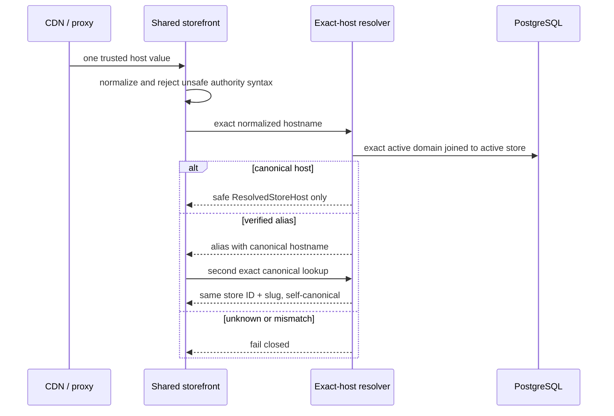
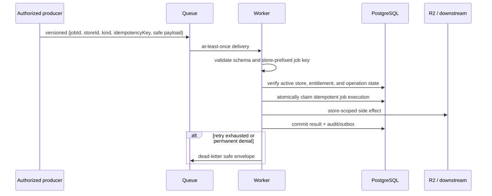

# Phase 2 Shared SaaS Target Architecture

Status: planning only; staging readiness is **NOT READY**. This document authorizes no deployment, database connection, migration execution, identity-provider configuration, DNS/TLS change, or feature activation.

## Source-of-truth audit

Phase 2 starts from `main` at `bfd07e1c4afffee4fdbcd7202549f14227fe601e`, the merge commit for PR #27. The frozen contracts in `packages/saas-contracts`, the ports in `packages/saas-data`, Tenant Core, registration/OIDC/session ports, exact-host storefront runtime, integration tests, and `docs/architecture/saas-implementation-boundaries.md` remain authoritative.

The audit found these boundaries:

| Area | Phase 1 authority | Phase 2 requirement |
| --- | --- | --- |
| Tenant creation | `CreateStarterTenant` and `SaaSDataRepository` ports; in-memory transaction | PostgreSQL implementation with atomic idempotency, RLS, and a narrow bootstrap authority |
| Registration | immutable workflow snapshots and guarded status transitions; in-memory stores | shared persistent workflow and OIDC transaction records safe across replicas |
| Sessions | opaque IDs, secure cookie policy, rotation/revocation ports; in-memory store | hashed persistent sessions with atomic rotation and immediate revocation |
| Panel authorization | issuer + subject principal authority, active membership, active store, entitlements | transaction-scoped PostgreSQL adapter and membership revalidation per request |
| Storefront | normalized exact-host resolver port; in-memory resolver; default runtime returns 503 | narrow exact-host database resolver, bounded caches, and verified custom-domain lifecycle |
| Namespaces | strict store-prefixed R2, cache, tag, and job key builders | production adapters that accept only server-established `store_id` |

Security properties currently proven only in one process include registration/OIDC single-use state, workflow immutability, session rotation, tenant-operation serialization, and cache/store namespace isolation. PostgreSQL concurrency, pool hygiene, replica-to-replica behavior, unknown commit state, queue delivery, and distributed invalidation remain unproven.

### Phase 1 disabled-state and undefined authority

At the audited base, `SELF_SERVE_SAAS_REGISTRATION_ENABLED` and `CUSTOMER_PANEL_AUTH_ENABLED` are hard-coded false; the internal Tenant Core route is disabled with an unavailable adapter; the customer-panel logout/callback uses disabled stores; and the shared storefront has no default resolver and returns a controlled 503. Store creation, provisioning, and auto-provisioning default false, while persistence defaults to the safe memory path unless explicitly selected under Phase 1 safety conditions. PR #27 records that no production adapter or deployment was activated, and `origin/deploy/owner` remains outside the Phase 1 main merge.

Infrastructure authority intentionally remains undefined in Phase 1: PostgreSQL provider/version/region and migration executor; runtime/database role issuer; backup/restore owner and objectives; workload identity and secret manager; CDN proxy-trust configuration; Redis/queue/R2 provider and account boundaries; staging Logto tenant/application; DNS/TLS/custom-domain verifier; observability vendor/retention; and production on-call. Phase 2 assigns required decisions and gates but does not choose accounts, read credentials, or mutate any resource.

## A. System topology

- `ecommerce.celebix.co` is the super-admin/control plane. It owns self-serve entry, internal tenant bootstrap invocation, support/audit workflows, and control-plane feature gates.
- `panel.celebix.site` is the shared customer-panel BFF. Browser code never receives provider or database credentials and never constructs tenant authority.
- `{slug}.celebix.site` is the shared platform storefront. Verified custom domains may resolve to the same runtime only after exact ownership verification.
- A separate shared SaaS PostgreSQL database is the authority for principals, stores, domains, memberships, plans, subscriptions, settings, tenant operations, registration workflows, OIDC transactions, sessions, and an outbox where required.
- A shared Redis/cache/queue layer provides bounded caching, distributed coordination, rate limits, and job delivery; PostgreSQL remains the durable authority.
- One shared R2 bucket stores objects only under `stores/{store_id}/...`.
- Logto is the OIDC identity provider. One server-side application uses the exact callback `https://panel.celebix.site/auth/callback` and Authorization Code + PKCE S256.
- Background workers consume store-bound jobs and re-authorize the store, entitlement, and job type before side effects.
- Existing dedicated stores, their admin/storefront applications, data, provisioning, and deployment remain separate and unchanged.


### Staging topology

Staging must use an isolated hostname set, separate PostgreSQL instance/database and roles, separate Redis namespace or instance, separate R2 bucket, separate queue topics, separate OIDC application, and separate observability dataset. It must contain synthetic data only. No staging credential may reach production and no production hostname may route to staging.

## B. Trust boundaries

| Boundary | Trusted input | Untrusted input | Required enforcement |
| --- | --- | --- | --- |
| Browser | secure opaque cookie only | body/query `storeId`, email, slug, redirects | BFF establishes identity and membership; origin/CSRF checks; no tokens in browser state |
| CDN/reverse proxy | configured downstream socket and canonical host field | public `Host`, forwarded headers | explicit proxy trust; one selected host; reject duplicates, commas, invalid authority syntax |
| Owner/control plane | authenticated operator or server workflow | registration form and public callback | rate limit; exact OIDC transaction; internal bootstrap authentication; safe errors |
| Customer-panel BFF | verified session lookup and database authority | cookie bytes, active-store hint | hash lookup; expiry/revocation; issuer+subject match; active membership every request |
| Shared storefront | exact normalized trusted host | suffix matches and path/query tenant hints | exact active-domain lookup; active store; canonical second lookup; no default |
| Internal bootstrap service | frozen `CreateStarterTenantInput` | arbitrary internal JSON or replay | schema validation, workload identity, isolated table-constrained bootstrap role, idempotency fingerprint |
| PostgreSQL | constraints, RLS, transaction-local context | pooled connection state and application predicates | least-privilege roles, `FORCE RLS`, `SET LOCAL`, pool reset, migration checksums |
| Redis | keys produced by namespace builders | caller-composed keys or wildcard invalidation | adapter-owned prefixes, ACLs, bounded TTL, no cross-store scans |
| R2 | generated server object key | filename/path/content type from client | prefix binding, magic-byte validation, size/quota checks, scoped signed operations |
| Identity provider | signed claims from exact issuer/JWKS/audience | callback parameters and display metadata | state/nonce/PKCE, exact redirect, atomic consume, verified email requirement |
| Background workers | versioned job envelope from approved producer | queue body and stale job state | schema validation, job/store binding, entitlement recheck, idempotency, DLQ |
| Observability | approved safe identifiers | payloads, tokens, cookies, SQL/stack details | centralized allowlist/redaction, access controls, retention, audit immutability |

## C. Tenant identity flow

`store_id` is a server-generated stable identifier. Slugs and hostnames are mutable lookup attributes and never replace it.

| Context | How `store_id` is established | Binding checks |
| --- | --- | --- |
| Authenticated panel request | session principal -> active membership discovery -> active-store selection | session issuer+subject equals principal authority; membership active; store active; entitlement active |
| Anonymous storefront | trusted host -> normalization -> exact active domain -> active store | returned ID and slug match store; aliases perform a second exact canonical lookup to the same ID and slug |
| Background job | signed/versioned producer envelope containing server-derived store ID | job type allowed, store active, entitlement current, idempotency key includes store ID |
| Cache key/tag | `TenantContext.store.id` or storefront request context | adapter constructs key; namespace version is positive; callers cannot pass raw full keys |
| R2 path | `TenantContext.store.id` | adapter emits `stores/{store_id}/{kind}/{generated-name}` and verifies the same prefix on all operations |
| Audit log | authoritative request/job context | safe store/principal IDs plus request/operation/job correlation; no client hint promoted |
| Internal tenant creation | generated inside the bootstrap transaction | caller supplies no store/membership/domain IDs; committed result binds all generated rows |

## D. No-authority rules

- A browser-provided `storeId` is never authority; it is at most a selection hint checked against current active membership.
- A URL slug is never sufficient authority; it must resolve to and match a persisted active store.
- Email is contact metadata, never principal authority. Principal authority is exact OIDC issuer plus subject.
- Hostname suffix matching is never tenant resolution. Only an exact normalized active-domain record resolves.
- There is no default tenant for a missing, unknown, invalid, ambiguous, inactive, or unverified hostname.
- Provider access, refresh, and ID tokens never enter frontend state, `TenantContext`, URLs, logs, or application errors.
- No global service-role or BYPASSRLS client is permitted in a public request path.
- No session, handoff, state recovery, or reusable authentication token is placed in a query string or fragment. The OIDC authorization response carries only its protocol-required one-time state and code.

## E. Runtime data flows

### Registration and OIDC

```mermaid
sequenceDiagram
  participant B as Browser
  participant O as Owner
  participant W as Workflow store
  participant T as OIDC transaction store
  participant I as Logto
  participant P as Panel callback BFF
  B->>O: validated registration fields
  O->>T: save hash(state), nonce, encrypted PKCE verifier, expiry
  O->>W: save immutable attempt + fixed requestedAt + idempotency key
  O-->>B: authorization redirect
  B->>I: Authorization Code + PKCE challenge
  I-->>P: exact callback with code + one-time state
  P->>T: atomic consume(state)
  P->>I: code exchange with PKCE verifier
  I-->>P: signed claims
  P->>P: validate issuer, audience, JWKS, nonce, subject, verified email
  P->>W: atomic awaiting_identity -> identity_verified with validated snapshot
  P->>O: frozen CreateStarterTenantInput over internal boundary
  O-->>P: committed result or safe error
  P->>W: persist result and pending session snapshot
  P-->>B: secure session cookie; fixed panel redirect
```

### Tenant bootstrap transaction

```mermaid
sequenceDiagram
  participant O as Internal caller
  participant T as Tenant Core + PostgreSQL repository
  participant D as PostgreSQL
  O->>T: frozen input + idempotency key/fingerprint
  T->>D: checkout isolated bootstrap-role client; BEGIN READ COMMITTED
  T->>D: INSERT operation ON CONFLICT DO NOTHING RETURNING
  alt claim created
    T->>D: create/update principal; create store/domain/membership/subscription/settings
    T->>D: mark operation committed with immutable result_payload
    T->>D: COMMIT
    T-->>O: created result
  else existing claim
    T->>D: new-statement exact read of winner row
    T->>D: ROLLBACK read-only bootstrap transaction
    T-->>O: committed replay, mismatch, or fail-closed indeterminate status
  end
```

### Panel request authorization

```mermaid
sequenceDiagram
  participant B as Browser
  participant P as Panel BFF
  participant S as Session store
  participant D as PostgreSQL
  B->>P: secure opaque cookie + optional store selection hint
  P->>S: HMAC-hash ID and read active session
  S-->>P: principal + active store + expiry/revocation state
  P->>D: principal-scoped active memberships
  P->>D: SET LOCAL principal/store; load authority, store, entitlement, host
  alt every binding is current and active
    P-->>B: tenant-scoped response
  else missing, stale, revoked, or mismatched
    P->>S: revoke invalid session when appropriate
    P-->>B: deny without tenant data
  end
```

### Storefront host resolution



### Session recovery

```mermaid
sequenceDiagram
  participant U as Authenticated user
  participant P as Panel BFF
  participant W as Registration workflow
  participant S as Session store
  participant D as SaaS PostgreSQL
  U->>P: authenticated recovery request with safe attempt ID
  P->>W: load non-expired workflow
  P->>P: match issuer+subject (and verified email when identity recovery)
  P->>D: verify committed tenant operation and active membership
  P->>S: idempotently create pending session or read existing
  P->>W: atomic status -> session_created
  P-->>U: rotate/set secure cookie; no token in URL
```

### Background job tenant binding



## Observability, audit, and PII policy

Every component emits structured events through an allowlisted schema. Required events are `registration_started`, `identity_verified`, `tenant_bootstrap_started`, `tenant_bootstrap_committed`, `tenant_bootstrap_failed`, `session_created`, `session_rotated`, `session_revoked`, `active_store_changed`, `domain_verification_changed`, `hostname_resolution_denied`, `membership_denied`, `rls_authorization_denied`, `idempotency_mismatch`, and `worker_job_failed`.

Required correlation fields are request ID, operation ID, authoritative store ID, principal ID, safe attempt ID, and job ID when applicable. Missing fields are omitted, never filled from untrusted hints. Logs must contain no access token, refresh token, ID token, PKCE verifier, database URL, session ID, raw cookie, full registration payload, or customer PII beyond approved identifiers. Email, phone, names, provider payloads, SQL parameters, and exception dumps are excluded or irreversibly tokenized according to the approved data dictionary.

Initial proposed metrics and paging thresholds, to be calibrated in staging:

| Signal | Warning | Page / automatic response |
| --- | --- | --- |
| bootstrap failure ratio | >2% for 10 minutes with at least 20 attempts | >5% for 5 minutes; disable store creation |
| idempotency mismatch | any event | 3 in 10 minutes; disable registration and investigate abuse/client defect |
| RLS or membership denial anomaly | 2x seven-day same-hour baseline | 10x baseline or cross-store test sentinel; disable affected public adapter |
| OIDC callback failure | >5% for 10 minutes | >15% for 5 minutes; disable OIDC login/registration start |
| session-store errors | >1% for 5 minutes | >5% for 5 minutes; disable login and preserve revocation fail-closed |
| exact-host denied ratio | >5% above baseline | cache divergence or known-host denial >1 minute; disable resolver/cache path |
| worker DLQ | any Critical job or >10 jobs/15 minutes | pause job kind; page owner |
| pool saturation | >70% for 10 minutes | >90% for 5 minutes or checkout timeout >1%; shed load |
| registration rate | >3 per IP/hour or >5 per verified principal/day | enforce rate limit/challenge; mass-creation alert |

## Feature flags and kill switches

All flags default disabled until staging evidence and Atlas approval. The concrete names are proposed; implementation must preserve the existing Phase 1 hard-disabled constants until their owning workstream is approved.

| Flag | Dependencies / enable order | Disable order and disabled behavior | Consistency and rollback |
| --- | --- | --- | --- |
| `SAAS_TENANT_CORE_POSTGRES_ENABLED` | migrations, RLS, bootstrap authority, backups; enable first for synthetic internal traffic | disable after store creation and registration; Tenant Core returns unavailable | committed rows remain authoritative; reconcile in-flight operation keys before re-enable |
| `SAAS_PERSISTENT_REGISTRATION_STORE_ENABLED` | PostgreSQL adapter | disable registration start first; existing attempts remain readable only for approved recovery | never fall back to process memory for accepted attempts; drain/expire records |
| `SAAS_PERSISTENT_SESSION_STORE_ENABLED` | PostgreSQL, membership adapter | disable OIDC login first; all requests deny and cookies are cleared | no in-memory fallback; preserve revocation records through max lifetime |
| `SAAS_OIDC_LOGIN_ENABLED` | OIDC transaction store, provider validation, persistent session store | disable registration and new login first; callbacks fail closed, existing sessions follow session policy | revoke/rotate provider secret separately; never accept callback without stored transaction |
| `SELF_SERVE_SAAS_REGISTRATION_ENABLED` | persistent workflow, OIDC, rate limits, and allowlisted store creation already proven/enabled | disable first during rollback; `/kayit` returns controlled unavailable response | existing workflows may be recovered only by authenticated path |
| `SAAS_STORE_CREATION_ENABLED` | Tenant Core PostgreSQL, isolated bootstrap role, audit and quotas | enable only for direct allowlisted synthetic calls before registration; disable immediately after registration during rollback; no new bootstrap, replay/recovery only | inspect unknown commits and preserve committed result snapshots |
| `SAAS_SHARED_STOREFRONT_RESOLVER_ENABLED` | exact resolver, storefront data adapter, cache invalidation | disable before database adapter; shared storefront returns 503/no default | DNS unchanged; invalidate caches and keep dedicated stores untouched |
| `SAAS_CUSTOM_DOMAINS_ENABLED` | resolver, domain proof lifecycle, entitlement, DNS runbook approval | disable before resolver; platform subdomains continue if approved | mark pending/disabled, purge positive cache; do not delete proof/audit history |
| `SAAS_BACKGROUND_JOBS_ENABLED` | queue schema, worker auth, DLQ, idempotency | pause producers then consumers; preserve queued records | drain or quarantine by job kind; replay only after idempotency reconciliation |

Enable order is: PostgreSQL adapter -> persistent registration store -> persistent session store -> OIDC login -> store creation for direct allowlisted synthetic calls -> self-serve registration for allowlisted synthetic principals -> exact-host resolver for synthetic/allowlisted stores -> custom domains -> background jobs. Disable in the reverse dependency order, except self-serve registration is always the first emergency kill switch and store creation immediately follows it.

## Rollback and recovery principles

1. Kill new writes before changing readers.
2. Never roll back schema while any running binary depends on it; use expand/contract migrations.
3. Persistent adapters never fall back to in-memory state after accepting durable work.
4. Unknown commit state is quarantined by idempotency key and resolved on a fresh connection before any deliberate retry.
5. Restore is to a new isolated database, verified by checksums/RLS tests, then promoted through a separately approved cutover.
6. Cache and queue rollback never changes PostgreSQL authority; stale or unbound items are discarded.
7. Session-store uncertainty fails closed. Revocation records are retained at least through the maximum session lifetime.
8. Dedicated stores and `deploy/owner` are outside this rollback domain and remain unchanged.

## Production readiness blockers

Production remains blocked until the migration rehearsal, rollback and restore proofs, RLS and concurrency tests, identity-provider staging validation, tenant isolation matrix, observability alerts, dependency security sign-off, incident runbooks, and every gate in `docs/ops/saas-phase2-staging-readiness-gate.md` pass. This planning document supplies no such evidence.
