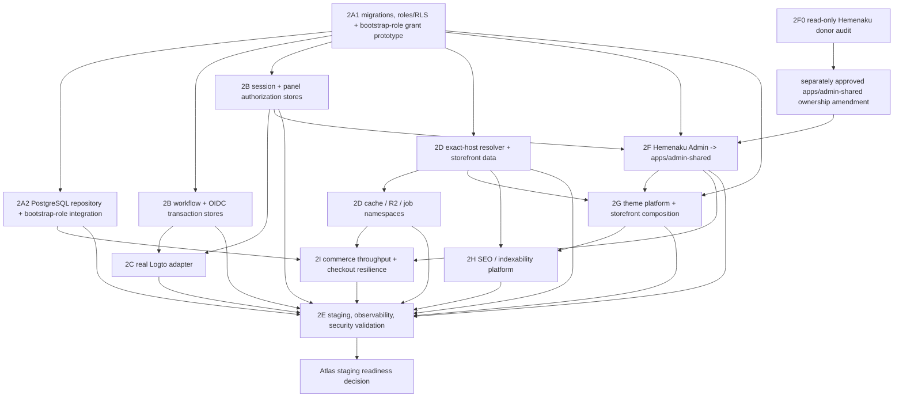

# Phase 2 Workstreams and Dependency Roadmap

Status: implementation roadmap only. Do not begin a workstream without an explicit Atlas task and its listed entry gate. Existing Phase 1 ownership boundaries and frozen contracts remain unchanged.

## Dependency graph

2A is the persistence foundation. 2B may start schema/API design beside 2A, while 2C depends on 2B persistence. 2D exact-host/cache/storage/job work depends on 2A. Phase 2F0 can audit the read-only Hemenaku donor immediately, but no `apps/admin-shared` file or runtime may be created until Atlas separately approves an ownership-boundary amendment naming that path; after that amendment, shell work also waits for 2B conventions to freeze. Theme platform 2G and SEO 2H can design in parallel but integrate through 2D/2F and shared URL/render contracts. Commerce/load 2I builds on 2A/2D and exposes admin/storefront surfaces through 2F/2G while respecting 2H. 2E is cross-cutting and cannot complete final staging validation until 2A–2I are integrated.

## Global constraints

- No workstream edits `packages/saas-contracts/**` or `docs/architecture/saas-implementation-boundaries.md`.
- `apps/admin/**` is the read-only Hemenaku Admin donor. It may be audited and copied/refactored into explicitly owned `apps/admin-shared/**` paths through the Phase 2F parity/security process, but no Phase 2 work edits the donor or live Hemenaku deployment/database/environment/domain. `apps/storefront-base/**`, dedicated storefronts, `stores/**`, dedicated provisioning/deployment/bootstrap/secret code, and customer deployments remain read-only/forbidden.
- No workstream changes `deploy/owner`, production flags, DNS/TLS, real Logto, R2, Redis, Coolify, queues, payments, or production infrastructure without a later explicit approval.
- Root `package.json`, `package-lock.json`, workspace wiring, integration tests, shared configuration, and cross-workstream conflicts belong only to the Integration Lead.
- Each adapter defaults disabled, has no in-memory fallback after durable acceptance, and must pass its isolation/rollback gate before a dependent flag can be considered.

## Phase 2A — Shared PostgreSQL schema and adapter foundation

**Goal:** turn the reviewed design into versioned, disposable-testable PostgreSQL migrations, roles/RLS, `SaaSDataRepository`, and a narrow bootstrap authority prototype.

**Inputs:** frozen SaaS contracts; `packages/saas-data` ports; Tenant Core; Phase 1 proposal/rollback SQL and static tests; target architecture, persistent-adapter contract, threat model, and rehearsal plan.

**Exact owned paths:**

- `packages/saas-data/**` for PostgreSQL adapter and conformance tests;
- `packages/saas-tenant-core/**` only where adapter integration tests require it, without frozen contract changes;
- `apps/owner/scripts/sql/saas/**` for versioned migrations, rollback/forward-recovery artifacts, roles/RLS/functions, and static checks;
- `apps/owner/lib/saas-tenant-core/**` for Owner adapter wiring behind disabled flags;
- `apps/owner/app/api/internal/saas-tenants/**` for the disabled internal invocation boundary and tests;
- `tests/saas-phase2/postgres/**` for disposable database, concurrency, privilege, and fault harnesses (created by this workstream subject to Integration Lead coordination).

**Forbidden paths:** all Agent B/C and globally forbidden paths; existing self-serve legacy SQL outside `apps/owner/scripts/sql/saas/**`; environment/deploy/workflow files; root manifests/lockfile.

**Outputs:** forward migration(s), safe rollback/forward-recovery plan, least-privilege roles and RLS, seeded `free_starter`, exact named constraints, PostgreSQL repository, preferred isolated/table-constrained BYPASSRLS bootstrap-role prototype, exact-host resolver authority contract stub if needed for 2D, and disposable evidence harness.

**Dependencies:** none beyond approved Phase 1 main and Atlas authorization. Phase 2A1 must precede adapter integration.

**Parallelization:** migration/role design and repository conformance-test design may proceed in parallel with shared schema names pinned by the 2A lead. Bootstrap privilege review follows the role draft. Only one owner edits a migration file. Do not parallelize competing migrations or role grants.

**Tests:** port conformance; migration/static checks; constraint/RLS/privilege matrix; same-key/slug/host/principal races; rollback injection; unknown commit; pool reset/timeouts; backup/restore rehearsal; schema dump/diff.

**Acceptance gate:** every Database gate row PASS in the disposable environment; Security approves the privilege matrix; committed result replay and zero partial-row proof pass; no production connection.

**Rollback boundary:** disable store creation and PostgreSQL adapter; preserve committed operations; use expand/contract and forward repair or verified restore; never fall back accepted work to in-memory state.

## Phase 2B — Persistent registration and session state

**Goal:** persist the shared registration workflow, OIDC transactions, panel sessions, revocation/rotation, panel authorization reads, and cleanup jobs safely across instances.

**Inputs:** Phase 1 Owner registration/OIDC interfaces, customer-panel completion/session/authorization interfaces, Phase 2A migration conventions and roles, approved encryption/retention decisions.

**Exact owned paths:**

- `apps/owner/app/api/self-serve/**`;
- `apps/owner/lib/self-serve-*.ts` and their tests for workflow/OIDC persistence behind disabled flags;
- `apps/customer-panel/lib/**` for persistent completion/session/authorization adapters and tests;
- `apps/customer-panel/app/auth/**` and `apps/customer-panel/app/api/**` only for disabled-by-default wiring;
- `apps/owner/scripts/sql/saas/**` only through a Phase 2A-owned migration change or reviewed handoff; Phase 2B does not independently edit shared migrations;
- `tests/saas-phase2/registration-session/**` with Integration Lead coordination.

**Forbidden paths:** Tenant Core/data adapter internals except imported ports; storefront packages; frozen/root/dedicated/deploy/infrastructure paths; provider credentials/configuration.

**Outputs:** PostgreSQL registration workflow store with versioned transitions, encrypted/digested OIDC transaction store, hashed session store, atomic rotation/revocation, 30-minute idle/8-hour absolute expiry, multi-device/revoke-all policy, panel authorization adapter, bounded cleanup jobs, and safe audit hooks.

**Dependencies:** schema/role conventions from 2A1. Session/authorization integration requires principals/memberships/stores/plan schema. OIDC transaction encryption requires approved key-management interface but no real key in code.

**Parallelization:** workflow and session adapter implementations may proceed in parallel after table/role contracts are frozen. The same engineer/PR must own a given workflow transition table. Cleanup work follows retention approval. Cross-app workflow tests are Integration Lead-owned.

**Tests:** Phase 1 store/session suites against PostgreSQL; optimistic-lock/status races; simultaneous state consume; A-create/B-complete/restart; pending-session recovery; fixation/replay/logout; rotation/store-switch race; membership revocation during request; expiry/cleanup; PII/redaction.

**Acceptance gate:** Code, Sessions, panel API tenant-isolation, OIDC-store, retention, and multi-instance rows PASS. Persistent flags remain disabled until 2C and 2E staging approval.

**Rollback boundary:** disable registration/OIDC login before stores; deny sessions if the persistent store is unavailable; retain revocations/workflows through their maximum lifetime; no memory fallback.

## Phase 2C — Real OIDC/Logto adapter

**Goal:** implement and validate the server-side provider adapter and runbook without configuring a real provider in unapproved environments.

**Inputs:** `OidcProviderPort`, exact callback constant, 2B transaction/session stores, identity threat model, separate staging issuer/application approved by Atlas.

**Exact owned paths:**

- `apps/owner/lib/self-serve-oidc.ts`, a narrowly named provider adapter beside it, and tests;
- `apps/owner/lib/self-serve-logto.ts` only to replace the disabled compatibility path behind flags;
- `apps/owner/app/api/self-serve/auth/**`;
- `apps/customer-panel/app/auth/**` and callback tests;
- `docs/ops/` provider configuration/rotation runbook created by the implementation task;
- `tests/saas-phase2/oidc/**` with Integration Lead coordination.

**Forbidden paths:** provider secrets/env files, production Logto configuration, DNS/TLS, Tenant Core/data/storefront, frozen/root/dedicated/deploy paths.

**Outputs:** exact issuer/discovery/JWKS adapter, Authorization Code + PKCE S256 start/exchange, issuer/audience/nonce/signature/time validation, verified-email handling, logout, secret/key rotation runbook, fake-provider and approved staging tests, audit/redaction events.

**Dependencies:** 2B OIDC one-time store and persistent session store PASS; provider application creation/configuration is a separate authorized operations action.

**Parallelization:** protocol adapter and fake-provider negative-test corpus may proceed in parallel. Callback wiring waits for adapter and 2B transaction semantics. One owner controls redirect/logout allowlists.

**Tests:** exact callback, duplicate parameters, state/nonce/PKCE, wrong issuer/audience/algorithm/key/time/subject/email verification, JWKS rotation/outage, token/error redaction, logout and secret rotation.

**Acceptance gate:** every Identity gate row PASS against fake and isolated staging provider, Security sign-off, and kill switch exercise. No production OIDC configuration or activation.

**Rollback boundary:** disable registration and OIDC login; consume/expire outstanding transactions; preserve/revoke local sessions; roll back provider adapter binary/config only through approved exact allowlist changes.

## Phase 2D — Exact-host production runtime and tenant namespaces

**Goal:** implement the PostgreSQL host/storefront data adapters and production-safe tenant namespacing for cache, R2, and jobs.

**Inputs:** exact-host Phase 1 runtime, namespace helpers, 2A domain/store schema and resolver authority, entitlement/membership rules, custom-domain threat model.

**Exact owned paths:**

- `packages/saas-storefront-runtime/**` for production resolver/data/cache/storage/job ports and tests without frozen contract changes;
- `apps/storefront-shared/**` for disabled-by-default resolver/data wiring;
- `tests/saas-phase2/storefront-isolation/**` with Integration Lead coordination;
- Phase 2A-owned SQL/resolver function changes only through a reviewed 2A handoff;
- new shared-SaaS media/cache/job adapters must live inside the Agent C paths above, not donor/dedicated apps.

**Forbidden paths:** Owner registration/panel session/Tenant Core ownership, R2/Redis/queue credentials or real resources, DNS/TLS/Coolify, frozen/root/dedicated/deploy paths.

**Outputs:** exact active-host PostgreSQL resolver, safe storefront store/entitlement loader, alias second-lookup support, bounded positive/negative cache and invalidation contract, custom-domain state adapter, R2 server port, Redis/cache port, versioned job envelope/worker authorization port, DLQ/retry policy.

**Dependencies:** 2A schema/RLS/resolver boundary. R2/job authorization consumes the established store/entitlement semantics; custom-domain activation also requires 2E operational proof.

**Parallelization:** exact resolver and namespace adapter test design may proceed in parallel after schema fields are frozen. Custom-domain lifecycle follows resolver correctness. R2, Redis, and job implementations can run in separate PRs if each uses the same pinned namespace and no shared file overlap. Shared storefront wiring comes last.

**Tests:** hostname normalization/suffix/default denial; alias/canonical/store races; cache poison/TTL/version/outbox; custom-domain claim/proof/release; R2 traversal/MIME/signed URL/cross-store operations; Redis collisions/ACL/wildcards; malicious/duplicate jobs, lock fencing, retry/DLQ; two-store isolation.

**Acceptance gate:** Storefront and all Tenant Isolation rows PASS in synthetic staging; exact resolver initially allowlists synthetic hosts; no custom domains/jobs until their individual gates pass.

**Rollback boundary:** disable job producers then consumers, custom domains, resolver, and caches in reverse dependency order; shared storefront returns controlled 503; purge exact synthetic caches/signed URLs; PostgreSQL remains authority.

## Phase 2E — Staging, observability, and security validation

**Goal:** integrate 2A–2I in isolated staging, produce the complete evidence package, and keep the final gate honest.

**Inputs:** candidate commits/adapters/migrations from 2A–2I, rehearsal plan, threat model, readiness gate, approved synthetic staging topology and provider/resource operations tasks.

**Exact owned paths:**

- `tests/saas-phase2/**` integration suites under Integration Lead coordination;
- `docs/ops/**` evidence indexes, incident/backup/restore/rollback/runbooks;
- component-owned instrumentation files only through their workstream PRs;
- staging configuration/workflows only if a later Atlas task explicitly authorizes them and assigns exact paths.

**Forbidden paths:** production configuration/data/resources, customer data, dedicated stores/deployments, unapproved root/deploy/workflow/env changes, secrets committed anywhere.

**Outputs:** isolated staging topology record, secret inventory/rotation evidence, structured audit/metrics/traces/alerts, health/SLO dashboards, distributed rate limiting and bot-defense decision, end-to-end synthetic QA, migration/rollback/restore evidence, dependency classification, incident tabletop, final PASS/FAIL report.

**Dependencies:** design work can begin immediately; complete execution depends on passing deliverables from 2A–2I and separately approved staging resource/configuration tasks.

**Parallelization:** observability schemas, threat-derived test cases, dependency classification, and runbook drafts can proceed early. Actual dashboards/alerts/load/E2E/rollback runs wait for integrated staging. One Integration Lead pins the candidate SHA and evidence manifest.

**Tests:** full Phase 1/current suite; all adapter/concurrency/isolation/OIDC/session/shared-admin/theme/SEO/storefront/storage/cache/job/commerce tests; redaction canaries; Hemenaku parity; crawler/theme certification; high-volume and Tenant X/Y load; alert/kill-switch/checkout-protection; backup/restore; end-to-end onboarding with theme -> tenant -> shared admin -> exact storefront -> checkout/order synthetic flow.

**Acceptance gate:** every row in `saas-phase2-staging-readiness-gate.md` PASS at one commit, no unaccepted Critical/High threat, Security/Ops/Product/Integration approvals, and Atlas staging decision. The current result remains NOT READY.

**Rollback boundary:** execute documented flags/kill switches, preserve audit/database state, revoke affected secrets/sessions, quarantine jobs/caches, restore to a new verified target when needed, and never touch dedicated stores.

## Phase 2F — Hemenaku Admin shared-panel adaptation

**Goal:** create `apps/admin-shared` as a safe multi-tenant derivative that preserves the mature Hemenaku Admin product while integrating Phase 1 OIDC/session/`TenantContext`/membership/active-store foundations.

**Safe donor rule:** `apps/admin/**` and the live/dedicated Hemenaku Admin are read-only. Donor code may be copied/refactored only after its file/module is classified and its UX parity target recorded. The derivative has no runtime import, shared database client, env, domain, logo, credential, or deployment coupling to Hemenaku. No live Hemenaku capability is removed or changed by Phase 2.

**Inputs:** Phase 1 `apps/customer-panel` security foundations; Hemenaku donor routes/components/APIs; frozen SaaS contracts; Phase 2B session/authorization adapters; 2A data/RLS conventions; target donor classification.

**Exact owned paths:**

- `apps/admin-shared/**`, excluding the theme/SEO/commerce subpaths assigned below;
- `apps/admin-shared/app/admin/themes/**` and `apps/admin-shared/lib/themes/**` are owned by 2G after the shared shell contract is pinned;
- `apps/admin-shared/app/admin/seo/**` and `apps/admin-shared/lib/seo/**` are owned by 2H;
- `apps/admin-shared/app/api/commerce/**` and `apps/admin-shared/lib/commerce/**` are owned by 2I;
- `tests/saas-phase2/admin-shared/**` with Integration Lead coordination.

**Forbidden paths:** edits to `apps/admin/**`, `apps/customer-panel/**` security contracts without 2B ownership, Hemenaku/dedicated database/env/domain/deploy, global service-role clients, root/frozen/dedicated/infrastructure paths.

**Outputs:** mandatory file-level donor inventory classifying every required module as reusable unchanged, reusable after tenant adaptation, Hemenaku-specific configurable, Hemenaku-specific excluded, or unsafe/replaced; shared app shell/navigation/UI parity; Phase 1 auth/session/store switch integration; store-bound product/variant/category/collection/brand/inventory/order/customer/promotion/media/content/settings/payment/shipping/report/staff APIs; role/entitlement/quota enforcement; parity and de-coupling report.

**Dependencies:** the read-only 2F0 donor audit can begin under its own explicit task. Creating or editing any `apps/admin-shared/**` file requires a separately approved Atlas ownership-boundary amendment naming that path; this roadmap does not grant it. After that amendment, shell/security work may begin when 2B context conventions freeze, while data/API activation depends on 2A and 2B. Payment/shipping configuration UI can be adapted, but commerce/provider activation depends on 2I.

**Parallelization:** audit modules in parallel with disjoint inventories; shell/security integration is one owner; module vertical slices may proceed on disjoint paths only after shared context/data-port conventions freeze. Theme/SEO/commerce teams consume the pinned shell extension points.

**Tests:** file-level classification; Hemenaku feature parity; two-store/all-role API matrix; browser hint/env/default-store attacks; PII export; query budgets; session/store rotation; static banned-import scan; build/typecheck; screenshot/interaction parity where approved; donor git/deploy unchanged.

**Acceptance gate:** all Section J readiness rows PASS for launch-required modules, with Product and Security approval. A missing mature capability is a blocker, not permission to ship a minimal panel.

**Rollback boundary:** disable `SAAS_SHARED_ADMIN_ENABLED`, revoke affected shared sessions, preserve shared data/workflows, and leave dedicated Hemenaku/other admins operating independently. Never fall back shared requests to donor data/env.

## Phase 2G — Theme platform and storefront composition

**Goal:** implement versioned catalog/private themes, onboarding selection, draft/preview/publish/rollback, certification, and all three storefront modes without coupling presentation to commerce authority.

**Inputs:** 2A schema/outbox conventions, 2D resolver/cache/R2/job adapters, 2F shared-admin extension points, shared storefront runtime, platform SEO/checkout contracts, future separately versioned theme/onboarding contracts.

**Exact owned paths:**

- new `packages/saas-theme-runtime/**` and `packages/saas-theme-contracts/**` only after separate contract-version approval;
- `apps/storefront-shared/lib/themes/**` and theme composition routes/components;
- `apps/admin-shared/app/admin/themes/**` and `apps/admin-shared/lib/themes/**`;
- `apps/owner/app/kayit/**` theme-onboarding UI and `apps/owner/lib/self-serve-theme-*.ts` through a reviewed 2B/Integration handoff;
- `tests/saas-phase2/themes/**`.

**Forbidden paths:** `apps/admin/**`, `apps/storefront-base/**`, dedicated storefronts, frozen Phase 1 contracts, arbitrary package execution, theme database/network/secret access, production storage/configuration.

**Outputs:** theme catalog/category/capability/version model; store assignment/draft/published/history model; onboarding theme flow; signed artifact/private-package model; preview grants; publication/rollback/outbox; compatibility and entitlement gates; custom theme request; custom/dedicated frontend API handoff; certification harness.

**Dependencies:** catalog/schema design may run beside 2F; actual shared-admin screens depend on its shell, public composition depends on 2D, certification's SEO portion depends on 2H, and real customer checkout compatibility depends on 2I.

**Parallelization:** catalog/data, declarative renderer/sandbox, onboarding UX, and certification fixtures can proceed on disjoint paths after schemas freeze. Private-package and custom-frontend tracks share the same compatibility/SEO/checkout contracts and cannot fork authority.

**Tests:** schema/version/compatibility; onboarding recovery; private visibility; supply-chain/sandbox; preview isolation/noindex; publish race/fault/rollback; cache/outbox; three frontend modes; commerce row invariance; SSR/mobile/performance and 2H certification.

**Acceptance gate:** all Section K and applicable M/N rows PASS; future contracts explicitly versioned/approved; all flags off until staging decision.

**Rollback boundary:** disable new theme onboarding/publish/private mode, revoke unsafe artifacts/previews, purge exact caches, and keep/restore last certified published snapshot. Commerce data is never rolled back by a theme rollback.

## Phase 2H — SEO and indexability platform

**Goal:** make crawlability/indexability, canonical/robots/sitemaps/redirects/structured data/SSR URL semantics a platform-owned invariant across every storefront mode and certified theme.

**Inputs:** 2D exact domain/canonical resolver, 2G read/theme composition, store-scoped published content/brand data, platform URL and indexability policies.

**Exact owned paths:**

- new `packages/saas-seo-runtime/**` and separately versioned SEO contracts if approved;
- `apps/storefront-shared/lib/seo/**`, tenant robots/sitemap routes, redirect/structured-data rendering;
- `apps/admin-shared/app/admin/seo/**` and `apps/admin-shared/lib/seo/**` for health/metadata UX;
- `tests/saas-phase2/seo/**` crawler/certification fixtures.

**Forbidden paths:** theme-owned canonical/robots/sitemap overrides, global sitemap/noindex, direct donor SEO/database clients, frozen contracts, dedicated storefront mutation, production search/index/DNS actions.

**Outputs:** indexability policy by content type; tenant robots and segmented sitemap service; canonical-domain authority; redirect ledger/301/410; structured-data projections; stable URL/stock/deleted-product/image-alt/hreflang/facet decisions; SSR requirements; automatic crawler/health alerts; theme certification SEO suite.

**Dependencies:** policy and test design can begin immediately; implementation needs 2D domain authority and published read model; theme certification integrates with 2G. Custom frontend mode must implement the same versioned SEO response contracts.

**Parallelization:** robots/sitemap, canonical/redirect, structured data, crawler health, and certification fixtures may proceed on disjoint paths after shared URL/content schemas freeze. One owner controls global platform SEO policy to prevent contradictory theme logic.

**Tests:** every eligible/noindex type; two-store sitemap; canonical/domain switch; no global noindex; redirects/loops/410; structured data vs visible content; SSR critical HTML; facets/query budget; theme override attacks; mobile/CWV; all three frontend modes.

**Acceptance gate:** every Section L SEO row and theme certification PASS. A storefront/theme/custom frontend without the platform SEO contract cannot publish.

**Rollback boundary:** block affected theme/storefront release, restore last safe store-scoped SEO/publication snapshot and redirect ledger version, purge exact caches; never serve a global noindex/default tenant fallback.

## Phase 2I — Commerce throughput and checkout resilience

**Goal:** define and implement the real cart/checkout/inventory reservation/order/payment/refund/shipping/outbox path, high-traffic read resilience, workload priority, and noisy-neighbor controls required before real-customer activation.

**Inputs:** 2A transaction/idempotency patterns, 2D namespaces/cache/jobs, 2F admin module ports, 2G storefront/read composition, threat model and launch-market payment/shipping/tax requirements.

**Exact owned paths:**

- new `packages/saas-commerce-contracts/**`, `packages/saas-commerce-data/**`, and `packages/saas-commerce-core/**` only after separate contract/version approval;
- `apps/storefront-shared/lib/commerce/**` and approved checkout/cart/API routes;
- `apps/admin-shared/app/api/commerce/**` and `apps/admin-shared/lib/commerce/**`;
- `tests/saas-phase2/commerce/**` and `tests/saas-phase2/load/**`;
- SQL changes only through Phase 2A-owned migrations/handoff.

**Forbidden paths:** donor/dedicated checkout/payment code changes, real provider credentials/calls/configuration, frozen tenant contracts, production queues/Redis/database/deploy, payment/customer data.

**Outputs:** versioned cart/checkout/inventory/reservation/order/payment/webhook/refund/shipping/tax/outbox contracts; unknown-commit/reconciliation; priority workload classes; rate/quota/fair queue/media/report controls; circuit/read-only/checkout-protection modes; high-volume read/query/cache budgets; Tenant X/Y load harness; dedicated escalation metrics/runbook.

**Dependencies:** schema/transaction work depends on 2A; job/cache/outbox on 2D; admin UX on 2F; storefront/cart presentation on 2G; public SEO remains 2H-owned. Provider-specific activation is a later separate operations/security gate.

**Parallelization:** contract/state-machine design, inventory race harness, webhook/idempotency fixtures, read/load harness, and workload-policy design can proceed in parallel after authority boundaries freeze. Order/payment/inventory code integrates sequentially through one state-machine owner.

**Tests:** high-volume catalog/cache; last-unit/multi-SKU reservation; duplicate/unknown-commit checkout/order/payment; signed/forged/replayed/out-of-order webhook; cancellation/release/refund/shipping/tax; outbox crash/DLQ; notification separation; per-IP/store quota; queue/pool fairness; Tenant X/Y degradation; threshold/escalation decision.

**Acceptance gate:** every Section N/O/P row PASS, launch-market reconciliation/support/incident owners approved, and Atlas explicitly authorizes real-customer activation. Phase 2 planning alone remains NOT READY.

**Rollback boundary:** disable new checkout/payment initiation, activate checkout protection/read-only/bulk kill switches as appropriate, preserve and reconcile durable orders/reservations/payment/outbox, continue only verified callbacks required to avoid financial inconsistency, and never blind-retry.

## Integration Lead ownership

The Integration Lead alone owns:

- root `package.json` and `package-lock.json`, workspace wiring, and dependency conflict resolution;
- `packages/saas-contracts/**` and the architecture ownership boundary (frozen; changes require separate schema/version approval);
- cross-workstream `tests/saas-phase2/**`, the Phase 1 regression matrix, and final end-to-end suite;
- shared feature-flag/configuration naming and dependency validation;
- `apps/admin-shared` cross-workstream shell extension points and conflicts among 2F theme/SEO/commerce subpaths;
- the Hemenaku donor parity baseline and proof that `apps/admin/**` and live/dedicated Hemenaku remain unchanged;
- integration branch/PR, conflict resolution, staging integration PR, evidence manifest, and final readiness report;
- ensuring documentation/migration/runtime PRs do not silently promote `deploy/owner` or any production resource.

## Parallelization rules

1. Parallel work is allowed only on disjoint owned paths with frozen shared interfaces.
2. 2A owns schema, role, constraint, function, and migration names; other workstreams propose changes through 2A rather than editing migration files concurrently.
3. 2B workflow and session adapters can run in parallel after schema conventions are pinned; 2C wiring waits for both.
4. 2D resolver and namespace test work can run beside 2B/2C; exact resolver implementation waits for the 2A domain authority.
5. 2F0 donor inventory can run under a separate explicit task; any `apps/admin-shared` creation or adaptation waits for a separately approved ownership-boundary amendment and then for 2B context/data conventions. `apps/admin/**` is never an implementation path.
6. 2G catalog/schema/sandbox and 2H SEO policy/crawler fixtures can run in parallel; theme publication waits for 2H certification contracts. 2I state-machine/load design can run beside them, but shared UI/routes use the assigned 2F/2G/2H subpaths.
7. 2E design/evidence tooling runs early; environment mutation and end-to-end execution wait for explicit authorization and integrated 2A–2I adapters.
8. No two agents edit the same file. Integration Lead resolves shared imports/config/tests and `apps/admin-shared` shell extension points.
9. Every PR is independently revertible behind default-off flags and must not combine a runtime adapter with production activation.
10. A failed parity, theme-supply-chain, indexability, commerce-correctness, noisy-neighbor, isolation, security, or concurrency review stops dependent work; tests are never weakened or bypassed.

## Staged implementation order

| Stage | Deliverable | Activation state |
| --- | --- | --- |
| 2A1 | versioned migration, roles/RLS, bootstrap-role grant prototype, read-only exact-host function prototype, disposable harness | all runtime flags off |
| 2A2 | PostgreSQL repository integration using the approved bootstrap role, plus concurrency/unknown-commit proof | internal synthetic only after review |
| 2B1 | persistent registration and OIDC transaction stores | registration/OIDC off |
| 2B2 | sessions, revocation/rotation, panel authorization | panel auth off |
| 2C | provider adapter and isolated staging OIDC validation | production issuer off |
| 2D1 | exact resolver/storefront data and invalidation | shared storefront resolver off |
| 2D2 | R2/Redis/jobs and custom-domain lifecycle | each subsystem off |
| 2F0 | read-only Hemenaku donor inventory, classification, parity baseline | no donor or shared-admin change |
| Ownership gate | separately approved amendment naming `apps/admin-shared/**` as an implementation path | no runtime change; 2F remains blocked until approval |
| 2F | `apps/admin-shared` shell/security and tenant-aware launch modules | shared admin off |
| 2G | theme catalog/onboarding/preview/publish/rollback and three storefront modes | theme/storefront flags off |
| 2H | platform SEO/indexability/canonical/sitemap/robots/certification | public storefront activation off |
| 2I | commerce state machines, throughput, workload isolation and escalation harness | commerce writes/providers off |
| 2E | isolated 2A–2I staging integration and complete readiness report | allowlisted synthetic staging only |
| Atlas gate | review evidence and decide next task | no automatic production continuation |

## Recommended exact next implementation task

**Phase 2A1 — Build the versioned shared-SaaS PostgreSQL migration and disposable conformance harness.**

Scope it to:

1. convert the Phase 1 proposal into versioned forward and rehearsal rollback/forward-recovery migrations under `apps/owner/scripts/sql/saas/**`;
2. define least-privilege roles, `FORCE RLS`, principal membership discovery, the preferred isolated/table-and-column-constrained BYPASSRLS bootstrap-role prototype, and a narrow read-only exact-host resolver prototype;
3. add a disposable PostgreSQL harness under `tests/saas-phase2/postgres/**` for schema/constraint/privilege/RLS checks, without connecting to production;
4. seed and verify the frozen `free_starter` plan;
5. produce checksummed schema dumps and cleanup proof;
6. keep every runtime adapter and feature flag disabled; do not configure Logto, DNS, R2, Redis, queues, Coolify, deploy, or credentials.

Acceptance is the Database portion of the readiness gate plus the RLS/privilege subset of the threat model. Do **not** include the PostgreSQL `SaaSDataRepository` implementation in 2A1; make that the next separately reviewed 2A2 task after schema authority is proven.

The only product track recommended to start in parallel is **Phase 2F0**, a read-only, file-level Hemenaku donor inventory/parity/security audit. It creates no `apps/admin-shared` runtime yet and makes no edit to `apps/admin/**`; its approved matrix becomes the input to the later 2F implementation task.

## Decision required

Atlas must approve or revise the preferred isolated BYPASSRLS bootstrap role and explicitly accept its residual risk, along with the proposed adapter table/retention/lifetime decisions, the 2A1 scope, staging resource boundaries, and named workstream owners before implementation begins. Separately, Atlas must approve an ownership-boundary amendment naming `apps/admin-shared/**` before 2F creates or edits that runtime; approval of this roadmap or 2F0 does not grant that ownership. This plan does not continue automatically.
