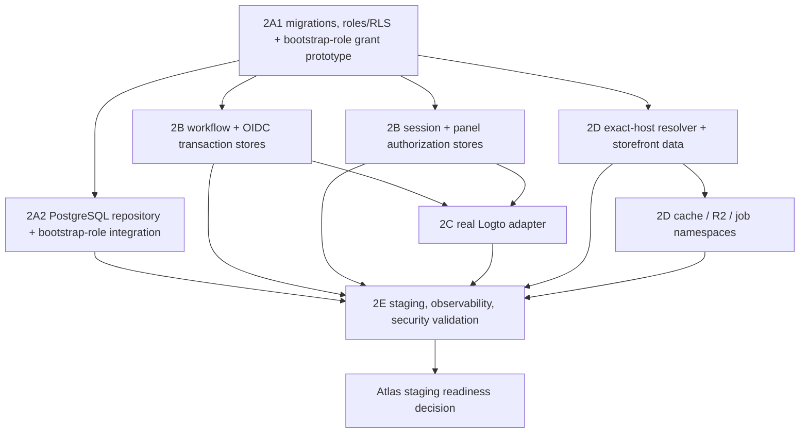

# Phase 2 Workstreams and Dependency Roadmap

Status: implementation roadmap only. Do not begin a workstream without an explicit Atlas task and its listed entry gate. Existing Phase 1 ownership boundaries and frozen contracts remain unchanged.

## Dependency graph

2A is the critical foundation. 2B may start its schema/API design beside 2A, but persistent integration waits for the approved migration/role conventions. 2C depends on 2B's one-time transaction and durable session behavior. 2D exact-host work depends on the domain/store schema and resolver authority; R2/Redis/jobs then depend on authoritative store binding and invalidation/outbox decisions. 2E builds observability/rate-limit harnesses early but cannot complete end-to-end validation until 2A–2D are integrated.

## Global constraints

- No workstream edits `packages/saas-contracts/**` or `docs/architecture/saas-implementation-boundaries.md`.
- No workstream edits `apps/admin/**`, `apps/storefront-base/**`, dedicated storefronts, `stores/**`, dedicated provisioning/deployment/bootstrap/secret code, or customer deployments.
- No workstream changes `deploy/owner`, production flags, DNS/TLS, real Logto, R2, Redis, Coolify, queues, payments, or production infrastructure without a later explicit approval.
- Root `package.json`, `package-lock.json`, workspace wiring, integration tests, shared configuration, and cross-workstream conflicts belong only to the Integration Lead.
- Each adapter defaults disabled, has no in-memory fallback after durable acceptance, and must pass its isolation/rollback gate before a dependent flag can be considered.

## Phase 2A — Shared PostgreSQL schema and adapter foundation

**Goal:** turn the reviewed design into versioned, disposable-testable PostgreSQL migrations, roles/RLS, `SaaSDataRepository`, and a narrow bootstrap authority prototype.

**Inputs:** frozen SaaS contracts; `packages/saas-data` ports; Tenant Core; Phase 1 proposal/rollback SQL and static tests; target architecture, persistent-adapter contract, threat model, and rehearsal plan.

**Exact owned paths:**

- `packages/saas-data/**` for PostgreSQL adapter and conformance tests;
- `packages/saas-tenant-core/**` only where adapter integration tests require it, without frozen contract changes;
- `apps/owner/scripts/sql/saas/**` for versioned migrations, rollback/forward-recovery artifacts, roles/RLS/functions, and static checks;
- `apps/owner/lib/saas-tenant-core/**` for Owner adapter wiring behind disabled flags;
- `apps/owner/app/api/internal/saas-tenants/**` for the disabled internal invocation boundary and tests;
- `tests/saas-phase2/postgres/**` for disposable database, concurrency, privilege, and fault harnesses (created by this workstream subject to Integration Lead coordination).

**Forbidden paths:** all Agent B/C and globally forbidden paths; existing self-serve legacy SQL outside `apps/owner/scripts/sql/saas/**`; environment/deploy/workflow files; root manifests/lockfile.

**Outputs:** forward migration(s), safe rollback/forward-recovery plan, least-privilege roles and RLS, seeded `free_starter`, exact named constraints, PostgreSQL repository, preferred isolated/table-constrained BYPASSRLS bootstrap-role prototype, exact-host resolver authority contract stub if needed for 2D, and disposable evidence harness.

**Dependencies:** none beyond approved Phase 1 main and Atlas authorization. Phase 2A1 must precede adapter integration.

**Parallelization:** migration/role design and repository conformance-test design may proceed in parallel with shared schema names pinned by the 2A lead. Bootstrap privilege review follows the role draft. Only one owner edits a migration file. Do not parallelize competing migrations or role grants.

**Tests:** port conformance; migration/static checks; constraint/RLS/privilege matrix; same-key/slug/host/principal races; rollback injection; unknown commit; pool reset/timeouts; backup/restore rehearsal; schema dump/diff.

**Acceptance gate:** every Database gate row PASS in the disposable environment; Security approves the privilege matrix; committed result replay and zero partial-row proof pass; no production connection.

**Rollback boundary:** disable store creation and PostgreSQL adapter; preserve committed operations; use expand/contract and forward repair or verified restore; never fall back accepted work to in-memory state.

## Phase 2B — Persistent registration and session state

**Goal:** persist the shared registration workflow, OIDC transactions, panel sessions, revocation/rotation, panel authorization reads, and cleanup jobs safely across instances.

**Inputs:** Phase 1 Owner registration/OIDC interfaces, customer-panel completion/session/authorization interfaces, Phase 2A migration conventions and roles, approved encryption/retention decisions.

**Exact owned paths:**

- `apps/owner/app/api/self-serve/**`;
- `apps/owner/lib/self-serve-*.ts` and their tests for workflow/OIDC persistence behind disabled flags;
- `apps/customer-panel/lib/**` for persistent completion/session/authorization adapters and tests;
- `apps/customer-panel/app/auth/**` and `apps/customer-panel/app/api/**` only for disabled-by-default wiring;
- `apps/owner/scripts/sql/saas/**` only through a Phase 2A-owned migration change or reviewed handoff; Phase 2B does not independently edit shared migrations;
- `tests/saas-phase2/registration-session/**` with Integration Lead coordination.

**Forbidden paths:** Tenant Core/data adapter internals except imported ports; storefront packages; frozen/root/dedicated/deploy/infrastructure paths; provider credentials/configuration.

**Outputs:** PostgreSQL registration workflow store with versioned transitions, encrypted/digested OIDC transaction store, hashed session store, atomic rotation/revocation, 30-minute idle/8-hour absolute expiry, multi-device/revoke-all policy, panel authorization adapter, bounded cleanup jobs, and safe audit hooks.

**Dependencies:** schema/role conventions from 2A1. Session/authorization integration requires principals/memberships/stores/plan schema. OIDC transaction encryption requires approved key-management interface but no real key in code.

**Parallelization:** workflow and session adapter implementations may proceed in parallel after table/role contracts are frozen. The same engineer/PR must own a given workflow transition table. Cleanup work follows retention approval. Cross-app workflow tests are Integration Lead-owned.

**Tests:** Phase 1 store/session suites against PostgreSQL; optimistic-lock/status races; simultaneous state consume; A-create/B-complete/restart; pending-session recovery; fixation/replay/logout; rotation/store-switch race; membership revocation during request; expiry/cleanup; PII/redaction.

**Acceptance gate:** Code, Sessions, panel API tenant-isolation, OIDC-store, retention, and multi-instance rows PASS. Persistent flags remain disabled until 2C and 2E staging approval.

**Rollback boundary:** disable registration/OIDC login before stores; deny sessions if the persistent store is unavailable; retain revocations/workflows through their maximum lifetime; no memory fallback.

## Phase 2C — Real OIDC/Logto adapter

**Goal:** implement and validate the server-side provider adapter and runbook without configuring a real provider in unapproved environments.

**Inputs:** `OidcProviderPort`, exact callback constant, 2B transaction/session stores, identity threat model, separate staging issuer/application approved by Atlas.

**Exact owned paths:**

- `apps/owner/lib/self-serve-oidc.ts`, a narrowly named provider adapter beside it, and tests;
- `apps/owner/lib/self-serve-logto.ts` only to replace the disabled compatibility path behind flags;
- `apps/owner/app/api/self-serve/auth/**`;
- `apps/customer-panel/app/auth/**` and callback tests;
- `docs/ops/` provider configuration/rotation runbook created by the implementation task;
- `tests/saas-phase2/oidc/**` with Integration Lead coordination.

**Forbidden paths:** provider secrets/env files, production Logto configuration, DNS/TLS, Tenant Core/data/storefront, frozen/root/dedicated/deploy paths.

**Outputs:** exact issuer/discovery/JWKS adapter, Authorization Code + PKCE S256 start/exchange, issuer/audience/nonce/signature/time validation, verified-email handling, logout, secret/key rotation runbook, fake-provider and approved staging tests, audit/redaction events.

**Dependencies:** 2B OIDC one-time store and persistent session store PASS; provider application creation/configuration is a separate authorized operations action.

**Parallelization:** protocol adapter and fake-provider negative-test corpus may proceed in parallel. Callback wiring waits for adapter and 2B transaction semantics. One owner controls redirect/logout allowlists.

**Tests:** exact callback, duplicate parameters, state/nonce/PKCE, wrong issuer/audience/algorithm/key/time/subject/email verification, JWKS rotation/outage, token/error redaction, logout and secret rotation.

**Acceptance gate:** every Identity gate row PASS against fake and isolated staging provider, Security sign-off, and kill switch exercise. No production OIDC configuration or activation.

**Rollback boundary:** disable registration and OIDC login; consume/expire outstanding transactions; preserve/revoke local sessions; roll back provider adapter binary/config only through approved exact allowlist changes.

## Phase 2D — Exact-host production runtime and tenant namespaces

**Goal:** implement the PostgreSQL host/storefront data adapters and production-safe tenant namespacing for cache, R2, and jobs.

**Inputs:** exact-host Phase 1 runtime, namespace helpers, 2A domain/store schema and resolver authority, entitlement/membership rules, custom-domain threat model.

**Exact owned paths:**

- `packages/saas-storefront-runtime/**` for production resolver/data/cache/storage/job ports and tests without frozen contract changes;
- `apps/storefront-shared/**` for disabled-by-default resolver/data wiring;
- `tests/saas-phase2/storefront-isolation/**` with Integration Lead coordination;
- Phase 2A-owned SQL/resolver function changes only through a reviewed 2A handoff;
- new shared-SaaS media/cache/job adapters must live inside the Agent C paths above, not donor/dedicated apps.

**Forbidden paths:** Owner registration/panel session/Tenant Core ownership, R2/Redis/queue credentials or real resources, DNS/TLS/Coolify, frozen/root/dedicated/deploy paths.

**Outputs:** exact active-host PostgreSQL resolver, safe storefront store/entitlement loader, alias second-lookup support, bounded positive/negative cache and invalidation contract, custom-domain state adapter, R2 server port, Redis/cache port, versioned job envelope/worker authorization port, DLQ/retry policy.

**Dependencies:** 2A schema/RLS/resolver boundary. R2/job authorization consumes the established store/entitlement semantics; custom-domain activation also requires 2E operational proof.

**Parallelization:** exact resolver and namespace adapter test design may proceed in parallel after schema fields are frozen. Custom-domain lifecycle follows resolver correctness. R2, Redis, and job implementations can run in separate PRs if each uses the same pinned namespace and no shared file overlap. Shared storefront wiring comes last.

**Tests:** hostname normalization/suffix/default denial; alias/canonical/store races; cache poison/TTL/version/outbox; custom-domain claim/proof/release; R2 traversal/MIME/signed URL/cross-store operations; Redis collisions/ACL/wildcards; malicious/duplicate jobs, lock fencing, retry/DLQ; two-store isolation.

**Acceptance gate:** Storefront and all Tenant Isolation rows PASS in synthetic staging; exact resolver initially allowlists synthetic hosts; no custom domains/jobs until their individual gates pass.

**Rollback boundary:** disable job producers then consumers, custom domains, resolver, and caches in reverse dependency order; shared storefront returns controlled 503; purge exact synthetic caches/signed URLs; PostgreSQL remains authority.

## Phase 2E — Staging, observability, and security validation

**Goal:** integrate 2A–2D in isolated staging, produce the complete evidence package, and keep the final gate honest.

**Inputs:** candidate commits/adapters/migrations, rehearsal plan, threat model, readiness gate, approved synthetic staging topology and provider/resource operations tasks.

**Exact owned paths:**

- `tests/saas-phase2/**` integration suites under Integration Lead coordination;
- `docs/ops/**` evidence indexes, incident/backup/restore/rollback/runbooks;
- component-owned instrumentation files only through their workstream PRs;
- staging configuration/workflows only if a later Atlas task explicitly authorizes them and assigns exact paths.

**Forbidden paths:** production configuration/data/resources, customer data, dedicated stores/deployments, unapproved root/deploy/workflow/env changes, secrets committed anywhere.

**Outputs:** isolated staging topology record, secret inventory/rotation evidence, structured audit/metrics/traces/alerts, health/SLO dashboards, distributed rate limiting and bot-defense decision, end-to-end synthetic QA, migration/rollback/restore evidence, dependency classification, incident tabletop, final PASS/FAIL report.

**Dependencies:** design work can begin immediately; execution depends on passing deliverables from 2A–2D and separately approved staging resource/configuration tasks.

**Parallelization:** observability schemas, threat-derived test cases, dependency classification, and runbook drafts can proceed early. Actual dashboards/alerts/load/E2E/rollback runs wait for integrated staging. One Integration Lead pins the candidate SHA and evidence manifest.

**Tests:** full Phase 1/current suite; all adapter/concurrency/isolation/OIDC/session/storefront/storage/cache/job tests; redaction canaries; load/rate limits; alert tests; kill-switch exercise; backup/restore; end-to-end registration -> tenant -> panel -> exact storefront -> job/media synthetic flow.

**Acceptance gate:** every row in `saas-phase2-staging-readiness-gate.md` PASS at one commit, no unaccepted Critical/High threat, Security/Ops/Product/Integration approvals, and Atlas staging decision. The current result remains NOT READY.

**Rollback boundary:** execute documented flags/kill switches, preserve audit/database state, revoke affected secrets/sessions, quarantine jobs/caches, restore to a new verified target when needed, and never touch dedicated stores.

## Integration Lead ownership

The Integration Lead alone owns:

- root `package.json` and `package-lock.json`, workspace wiring, and dependency conflict resolution;
- `packages/saas-contracts/**` and the architecture ownership boundary (frozen; changes require separate schema/version approval);
- cross-workstream `tests/saas-phase2/**`, the Phase 1 regression matrix, and final end-to-end suite;
- shared feature-flag/configuration naming and dependency validation;
- integration branch/PR, conflict resolution, staging integration PR, evidence manifest, and final readiness report;
- ensuring documentation/migration/runtime PRs do not silently promote `deploy/owner` or any production resource.

## Parallelization rules

1. Parallel work is allowed only on disjoint owned paths with frozen shared interfaces.
2. 2A owns schema, role, constraint, function, and migration names; other workstreams propose changes through 2A rather than editing migration files concurrently.
3. 2B workflow and session adapters can run in parallel after schema conventions are pinned; 2C wiring waits for both.
4. 2D resolver and namespace test work can run beside 2B/2C; exact resolver implementation waits for the 2A domain authority.
5. 2E design/evidence tooling runs early; environment mutation and end-to-end execution wait for explicit authorization and integrated adapters.
6. No two agents edit the same file. Integration Lead resolves shared imports/config/tests.
7. Every PR is independently revertible behind default-off flags and must not combine a runtime adapter with production activation.
8. A failed isolation/security/concurrency review stops dependent work; tests are never weakened or bypassed to unblock integration.

## Staged implementation order

| Stage | Deliverable | Activation state |
| --- | --- | --- |
| 2A1 | versioned migration, roles/RLS, bootstrap-role grant prototype, read-only exact-host function prototype, disposable harness | all runtime flags off |
| 2A2 | PostgreSQL repository integration using the approved bootstrap role, plus concurrency/unknown-commit proof | internal synthetic only after review |
| 2B1 | persistent registration and OIDC transaction stores | registration/OIDC off |
| 2B2 | sessions, revocation/rotation, panel authorization | panel auth off |
| 2C | provider adapter and isolated staging OIDC validation | production issuer off |
| 2D1 | exact resolver/storefront data and invalidation | shared storefront resolver off |
| 2D2 | R2/Redis/jobs and custom-domain lifecycle | each subsystem off |
| 2E | isolated staging integration and complete readiness report | allowlisted synthetic staging only |
| Atlas gate | review evidence and decide next task | no automatic production continuation |

## Recommended exact next implementation task

**Phase 2A1 — Build the versioned shared-SaaS PostgreSQL migration and disposable conformance harness.**

Scope it to:

1. convert the Phase 1 proposal into versioned forward and rehearsal rollback/forward-recovery migrations under `apps/owner/scripts/sql/saas/**`;
2. define least-privilege roles, `FORCE RLS`, principal membership discovery, the preferred isolated/table-and-column-constrained BYPASSRLS bootstrap-role prototype, and a narrow read-only exact-host resolver prototype;
3. add a disposable PostgreSQL harness under `tests/saas-phase2/postgres/**` for schema/constraint/privilege/RLS checks, without connecting to production;
4. seed and verify the frozen `free_starter` plan;
5. produce checksummed schema dumps and cleanup proof;
6. keep every runtime adapter and feature flag disabled; do not configure Logto, DNS, R2, Redis, queues, Coolify, deploy, or credentials.

Acceptance is the Database portion of the readiness gate plus the RLS/privilege subset of the threat model. Do **not** include the PostgreSQL `SaaSDataRepository` implementation in 2A1; make that the next separately reviewed 2A2 task after schema authority is proven.

## Decision required

Atlas must approve or revise the preferred isolated BYPASSRLS bootstrap role and explicitly accept its residual risk, along with the proposed adapter table/retention/lifetime decisions, the 2A1 scope, staging resource boundaries, and named workstream owners before implementation begins. This plan does not continue automatically.
