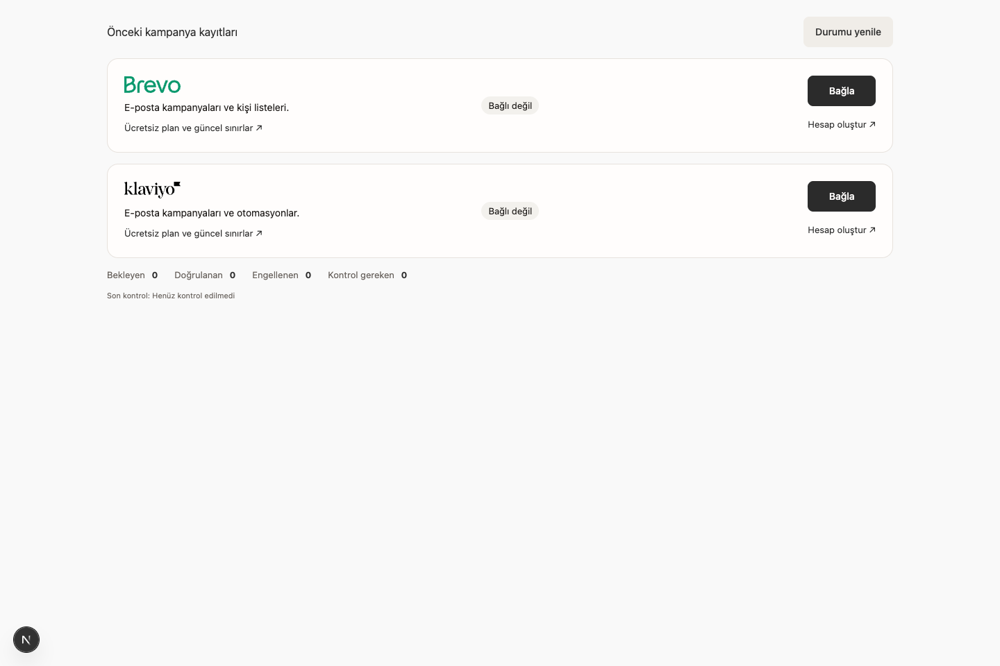
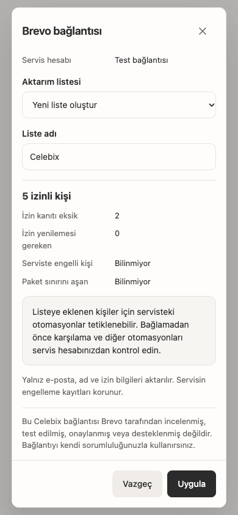

# Brevo / Klaviyo acceptance record

Date: 2026-10-09. Branch: `codex/email-provider-connections`.

**Historical isolated acceptance record.** The checks below preceded production publication and retain their original scope. The subsequent [2026-10-09 live release](live-release-20261009.md) applied native migration 224 and enabled Klaviyo on both shared panels after all six applications passed runtime acceptance. Brevo prerequisites and authorized real-account acceptance remain outstanding; this historical record does not certify provider behavior.

Reviewed base: `8ec4903155e8410548e5ce60e04edf7f9b2f87b9`.
Final implementation/build source: `2e7cec6495d74c9cf4be8f129ea44236b9ee6866`.
The later acceptance commit changes documentation/evidence only. A future release must seal its actual source, native baseline, configuration fingerprints and running container revisions afresh.

## Implemented scope

- Shared Pazarlama → E-posta cards with official local Brevo/Klaviyo logos, merchant-owned keys, list selection, audience preview and Uygula/Vazgeç. One active provider per store. Brevo's initial import requires a dedicated new list.
- Original campaign records preserved at `/marketing/email/history`; campaign editing/sending/reporting remain on each provider's official site.
- Address-bound proven email consent, optional names, original date/source/version and managed-list membership only. No phone, address, order, debt, cart or catalog export.
- Server-encrypted tenant-bound credentials, narrow native permissions, exact host/session/Origin checks, support expiry checks, audit, idempotent commands and version conflicts.
- Durable source/outbox, bounded separate worker, incoming denials, polling, accepted/unknown readback, credential recovery, draining and minimum cleanup-key retention. `202` never means verified completion.
- Disabled by default; missing SQL/key/configuration does not break the existing panel. No new dependency or provider SDK.

## Verification matrix

| Check | Observed result | Boundary / limitation |
|---|---|---|
| Contracts package suite | 569 passed, 0 failed, 0 skipped | Full package run before final data-only repairs; contract source unchanged |
| Final data package suite | 991 tests: 987 passed, 0 failed, 4 configuration-dependent skips | Final code; no implicit production database connection |
| Final email provider/HTTP/UI/worker repair suites | 63 tests: 61 passed, 0 failed, 2 native-config skips | Separate explicit native run covers email native paths |
| Explicit isolated PostgreSQL + owner/source regression run | 48 passed, 0 failed, 0 skipped | PostgreSQL 16, local Unix socket; no live service |
| Existing customer, Google, manual-sales, payment, engagement, review, restock and popup panel regressions | 209 passed, 0 failed, 0 skipped | Targeted existing tests; not a complete business-wide live acceptance |
| Contracts/data/panel/owner/shared-storefront type checks | Passed | Final app builds also completed TypeScript checks |
| Shared Customer Panel production build | Passed; compilation 85s, TypeScript 36.2s | Source-bound local Coolify build wrapper; no deploy |
| Owner production build | Passed; compilation 11.3s, TypeScript 8.0s | Source-bound local build; worker not enabled in production |
| Shared storefront production build | Passed; compilation 14.9s, TypeScript 9.3s | Source-bound local build; no live reader update |
| SQL up/replay, empty down/up/reapply/replay | Passed | Unrelated function definitions, rows and ACLs preserved in isolated rehearsal |
| Populated destructive down | Refused as intended | Retained connection/evidence cannot be silently deleted |
| Native tenant/support/lease authority | Passed | Forged store, expired support/candidate and old/null lease rejected |
| Consent/bootstrap/recovery | Passed | 205-profile pagination, historical denial/archive, address change, name correction, async acceptance, rotation, list-scoped denial, draining, hook authentication/deduplication |
| Rendered UI | Passed at 1440, 1024 and 390px | Real components in temporary Next fixture; synthetic provider API and no authenticated live store shell |
| Production route isolation | Passed | Email component chunks absent from orders/products/design/marketing landing routes; see `route-isolation.json` |
| Real Brevo / Klaviyo account acceptance | **Pending** | Authorized accounts, keys, recipients and automation scope not supplied/activated |
| Shared NET → SITE rollout / new tenant live acceptance | **Pending** | No SQL ID, ref, pin, deployment queue, live key/configuration or customer export changed |

Suite counts overlap; they are not summed as unique tests. The four general data skips are reported explicitly. Real provider behavior is not inferred from mocks, native tests or builds.

Build preflight first rejected a missing full `SOURCE_COMMIT`; an owner invocation with an abbreviated SHA was also rejected. Retrying with the full implementation SHA passed all three wrappers. Generated local payment metadata was restored after builds; payment approvals and live modes were untouched.

## Fresh whole-branch review and repair

A fresh read-only `gpt-6-astra` review examined the branch against the plan/spec. One Critical and six Important findings entered one RED→GREEN repair pass, committed as `2e7cec649`:

1. Include historical customer denial/archive evidence without inventing old grants.
2. Distinguish proven unissued/rejected effects from writes with unknown outcomes. Only safely unsent work may redispatch, including list/hook creation. A success followed by failed readback retains the original effect.
3. Mark actual authentication rejection separately; validated key recovery resumes only unsent authentication-blocked work. Consent/suppression blocks remain blocked.
4. Enforce Brevo's dedicated new-list import on both native and UI boundaries; show the automation-trigger notice before applying.
5. Prefer the current live connection over unrelated older connection generations.
6. Propagate optional-name corrections while preserving consent date/sequence and subscription status.
7. Report bootstrap/polling progress truthfully; a lost lease or partial page is not verified completion.

The minor timestamp observation was also corrected: “Son kontrol” uses the completed suppression-check time, not page-read time. There are no deferred review minors. No second whole-branch review was performed; repair coverage and the subsequent green suites/builds are the evidence.

Reviewer-declined areas were resolved as follows:

- **Performance:** measured separately below; no live-capacity or zero-cost claim follows.
- **Real account behavior:** remains pending until the merchant authorizes concrete keys, recipients and automation effects. Cost of deferral: real-account compatibility is unproven.
- **Publication prerequisites:** remain gates. Brevo registration is an explicit term; written clarification of encrypted merchant-key handling and Klaviyo's provider-choice/mark/authentication scope resolves ambiguous applicability. Cost of deferral: production activation waits.

## Performance evidence

`performance-production-cadence.json` records three off/full comparisons: four synthetic stores with 250 seeded profiles each, four concurrent clients, 200 warm-up requests followed by 1,000 measured requests per variant (500 local overview / 500 native consent-outbox saves), 80ms pacing, production worker interval 5,000ms. The actual HTTP handler/repository/native authority and worker were used. Session approval is a synthetic boundary; provider latency is simulated at 10ms. This is not a full customer form, external network or production server benchmark.

| Pair | Panel p95 off → full | Change | Native source-save p95 off → full |
|---|---:|---:|---:|
| 1 | 5.755 → 6.547ms | +13.760% | 4.201 → 5.253ms (+25.041%) |
| 2 | 6.497 → 6.183ms | −4.829% | 4.855 → 4.910ms (+1.144%) |
| 3 | 5.737 → 6.202ms | +8.107% | 4.683 → 4.769ms (+1.843%) |

There was one panel increase above 10%, **not a repeatable threshold failure** in two or more pairs. This is neither “every run below 10%” nor a guarantee that production will not slow down. Live workload/network/host contention must be reassessed before increasing concurrency or making delivery promises.

- Dedicated pool wait p95: approximately 0.025–0.032ms. Node CPU: 827–971ms per roughly 21-second variant. Node RSS: 60–161MiB; sequential runs share process/GC history, so these observations do not prove absence of a leak. PostgreSQL server CPU was not measured.
- Full mode made 10, 10 and 8 simulated provider calls (~0.38–0.48/s); off mode made none. All four stores received work. Global capacity remained two leased jobs and a four-connection worker pool.
- Queue age at sampling was approximately 25–31 seconds with ~401–402 queued entries/store. The short test does not prove sustained drain capacity. The conservative cadence limits throughput; requests do not wait for export completion.
- The original 100ms stress experiment (50× production cadence) repeatedly failed the >10% gate and is retained in `performance-stress-100ms.json`. Claim-query investigation found a correlated aggregate repeated 1,004 times. Precomputed store fairness plus supporting indexes reduced the isolated explain observation from 99.826ms to 0.704ms; native fairness/capacity tests stayed green.
- An unrelated contended measurement was excluded. The first production-cadence attempt ended with local HTTP keepalive `ECONNRESET`; it was rerun with a 60-second server keepalive and completed. Failed/incomplete attempts are not counted as passing comparisons.

## Rendered UI evidence

Installed Playwright controlled Chrome because the Browser plugin was unavailable. A temporary Next route rendered the actual components/root styles with a synthetic API; it was removed after QA and is absent from the production build. No real key or customer PII appears in the captures.

At all three widths: two meaningful branded cards, local logos, no horizontal overflow/framework error overlay, Brevo new-list-only selection and automation notice, unknown-result same-operation retry with retained list, cleared password input, modal focus/Tab/Escape and focus return passed. Buttons are 44px high. `rendered-ui.json` records measurements/requests. One exact `/favicon.ico` 404 was recorded as an asset warning on the first fixture load, separate from zero application console/page errors; it was not broadly filtered out.

The production route chunk map independently verifies no email component chunks on orders, products, design or the marketing landing route. Rendered local logos generated no provider/hotlink request. These checks do not prove a live authenticated page has been accepted.

## Release and rollback handoff

`migration-manifest.json` intentionally has no production migration ID/container/configuration fingerprint. Latest read-only shared release status during preparation showed no active deployments and shared target source `8ec4903155…`; this is a point-in-time observation, not authority for a future release. Mira coordination remains authorized; no competing publication was initiated here.

Before activation: resolve provider gates using the prepared unsent requests in `docs/ops/email-marketing-provider-approval-requests.md`; obtain merchant-authorized test-account/recipient/automation scope; refresh current release owner, running sources, keys and native/ACL baselines; allocate SQL under that release; publish compatible owner/readers, then shared panels NET → SITE; verify actual containers and only then enable controls/full worker and run real acceptance. Existing and future tenants receive the common application, with their own provider account/key and consent scope.

Rollback closes new grants/imports with `revoke_only` while retaining incoming denials, readback and cleanup. Populated down is destructive and intentionally refused. If revocation processing cannot run, external sends must be paused and pending denials settled before rollback is complete. No production rollback was performed or claimed.

## Subsequent manual-export correction

The user's later manual-only request supersedes bootstrap/automatic name fanout in the original source. See [manual-acceptance.md](manual-acceptance.md) for revised behavior, scoped tests, large-list experiment and limitations. No live activation is implied by either document.
