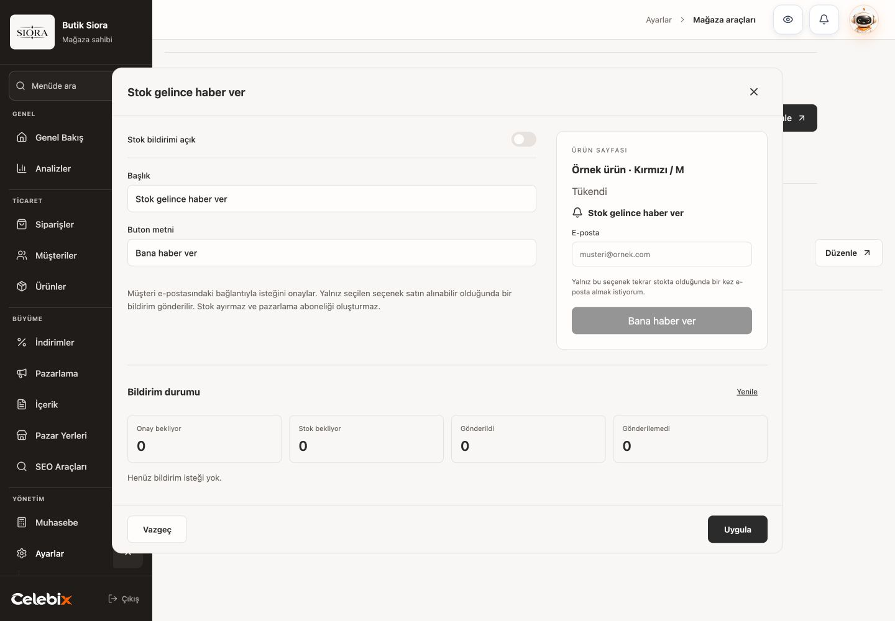
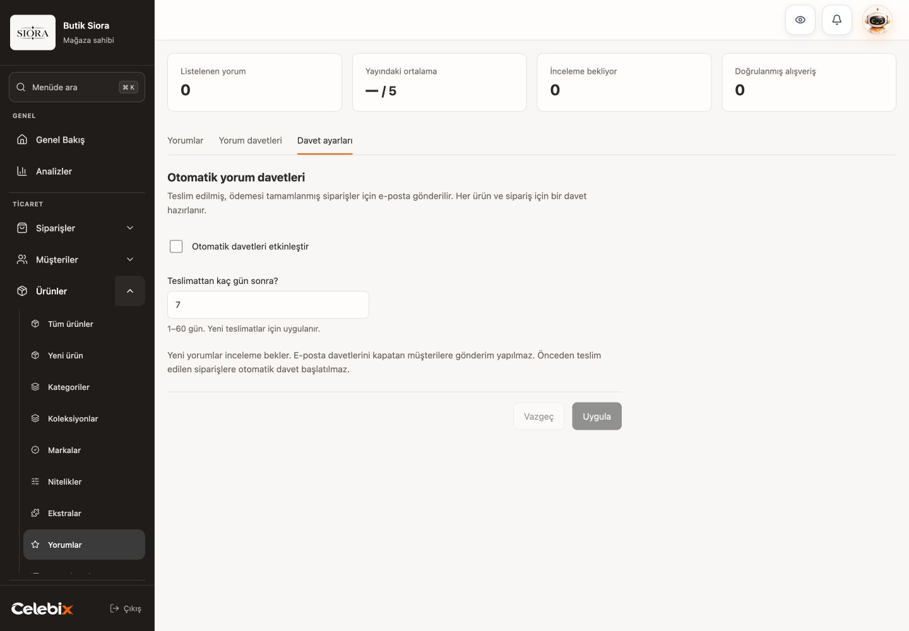
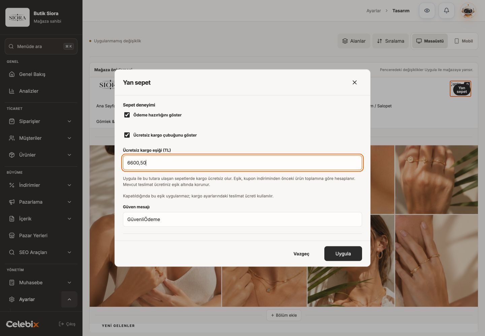

# Mağaza destek özellikleri — canlı kabul

Tarih: 3 Ekim 2026. Yayımlanan kod: `f7b51d1ba40c3580e4a063185493c74c7cf9b480`.
Mağaza: Butik Siora. Oturum: mağaza sahibi. Ekranlar gerçek ortak üretim panelinden alınmıştır.

## Stok bildirimi

Konum: Ayarlar → Mağaza araçları. Kapalı ayarlarla Uygula başarılı oldu; yeniden yükleme aynı ayarı getirdi. Kaydedilmeyen etkinleştirme Vazgeç ile bırakıldı. İstatistikler sıfır; müşteri talebi veya e-posta oluşturulmadı.

## Yorum toplama

Konum: Ürünler → Yorumlar. Yorumlar, Yorum davetleri ve Davet ayarları sekmeleri gerçek kaynaklara bağlıdır. Otomatik davet kapalıyken 8 gün kaydedildi, ardından 7 güne geri kaydedildi. Yeniden yükleme sonrası kapalı / 7 gün görüldü. Vazgeç, kaydedilmeyen değişikliği bıraktı.

## Ücretsiz kargo çubuğu

Konum: Tasarım → Yan sepet. Aşağıdaki ekran, kaydedilmeyen `6600,50` TL eşik örneğidir. Geçerli tutarda Uygula açıldı; sıfır tutarda kapandı. Vazgeç sonrası mevcut kapalı ayar korundu. Canlı teslimat ücretleri değişmedi.

## Diğer doğrulamalar ve sınırlar

- 1440, 1024 ve 390 pikselde yerel gerçek bileşen kabulü: yatay taşma yok; stok penceresi eylemleri en az 44 px, odak dönüşü ve mobil erişim başarılı.
- İzole native PostgreSQL: gerçek ücretsiz kargo/ödeme hesabı, yorum daveti ve moderasyon, stok varyantı ve rezervasyon, süre sonu, mağaza ayrımı ve tekrar işlem kontrolleri başarılı.
- Resend taşıması kontrollü testlerde doğrulandı. İki canlı storefrontta görev önkontrolü ve çalışan süreç doğrulandı; gerçek e-posta teslim testi yapılmadı.
- Salt okunur son kontrolde etkin stok ve otomatik yorum ayarı 0; yorum daveti, stok aboneliği ve gönderim 0; mevcut ürün yorumları 3 olarak korundu.
- Dört ortak uygulamada aynı kod ve resmî ödeme metadata doğrulandı. Güzide, Lilyum, Alpler Spor ve Butik Siora admin/storefront sağlık kontrollerinin sekizi de başarılı.

Ayrıntılar: [operasyon raporu](../ops/2026-10-03-store-engagement.md).
