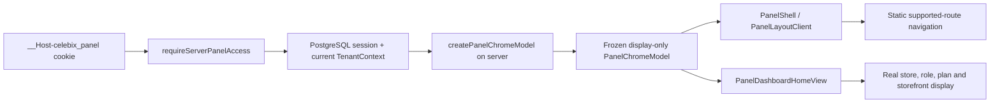

# Hemenaku Merchant Shell, Dashboard ve Responsive Navigasyon Tasarımı

**Tarih:** 2026-07-19

**Durum:** Kullanıcı yazılı incelemesini bekliyor

**Hedef uygulama:** `apps/customer-panel`

**Read-only donor:** `apps/admin`

**Çalışma tabanı:** `d020e96c6a7e5336e64d586683985fd6bf4f354e`

**Canlı donor referansı:** `deploy/admin/hemenaku` @ `fc6c5318b47f045a7cefcedc7612d5b10563ba32`

## 1. Amaç

İlk teslimat, canlı Hemenaku yönetim panelinin üretimde kanıtlanmış kabuk, dashboard yerleşimi ve responsive navigasyon dilini mevcut ortak SaaS müşteri paneline uyarlayacaktır.

Bu çalışma yeni bir admin tasarımı üretmez. Görsel ve etkileşim referansı yalnız `apps/admin` içindeki exact donor dosyalarıdır. Hedef uygulama `apps/customer-panel` olarak kalır ve mevcut kalıcı PostgreSQL session ile `TenantContext` tek yetki kaynağı olmaya devam eder.

İlk dilim şu sonucu üretir:

- Hemenaku ile aynı koyu masaüstü sidebar yapısı, yoğunluk, renk tokenları ve aktif durum dili;
- Hemenaku ile aynı sticky masaüstü topbar ve sayfa aksiyonu yerleşimi;
- desteklenen route’larla sınırlı sağdan açılan mobil drawer;
- desteklenen route’larla sınırlı safe-area uyumlu mobil bottom dock;
- Hemenaku dashboard’unun kart, boşluk ve responsive grid dilini kullanan, yalnız gerçek SaaS authority projection’ı gösteren dashboard;
- çalışan `/`, `/products`, `/products/new`, `/products/[productId]`, `/setup` ve logout akışları;
- hiçbir sahte KPI, çalışmayan link, legacy API, legacy auth veya browser tenant authority olmaması.

## 2. Sabit kararlar

1. `apps/admin` yalnız read-only donor kaynaktır; değiştirilmeyecektir.
2. Hedef uygulama `apps/customer-panel` olarak kalacaktır.
3. `__Host-celebix_panel` → server access guard → PostgreSQL `TenantContext` zinciri tek authentication ve tenant authority olacaktır.
4. Legacy Supabase/Logto admin session’ı, Hemenaku’ya özel tablolar, tek-mağaza varsayımları ve eski `/api/admin/**` çağrıları taşınmayacaktır.
5. Gerçek API veya kalıcı veri desteği olmayan modüller navigasyonda görünmeyecektir.
6. Iframe, reverse proxy, ikinci admin uygulaması veya `apps/admin-shared` oluşturulmayacaktır.
7. Production configuration, production deploy, production credential ve production veri mutasyonu bu dilimin dışındadır.
8. Donor arayüzü görsel/etkileşim kaynağıdır; donor data/auth kodu kaynak değildir.
9. İlk dilim yeni sipariş, analitik, bildirim, asistan veya PWA backend’i oluşturmaz.
10. İlk dilim boyunca var olan catalog API ve session-control davranışı değiştirilmez.

## 3. Kapsam ayrıştırması

Canlı donor uygulama 86 admin sayfası, 125 API route’u ve 135 TSX bileşeni içerir. Hedef customer panel mevcut tabanda 7 sayfa ve 14 API route’u içerir. Bu nedenle tam özellik eşliği tek değişiklik seti olarak ele alınmayacaktır.

Uzun vadeli program bağımsız, test edilebilir dilimlere ayrılır:

1. **Bu spec:** kabuk, güvenilir dashboard, desktop/mobile navigasyon.
2. Ürün kataloğu genişletmeleri: kategoriler, koleksiyonlar, medya, toplu işlemler ve gelişmiş stok.
3. Sipariş ve müşteri yönetimi.
4. İndirim, pazarlama ve içerik yönetimi.
5. Mağaza ayarları, ödeme, kargo ve yönetici/rol yönetimi.
6. Pazar yerleri, muhasebe ve SEO araçları.

Her sonraki dilim kendi spec → plan → implementation → staging doğrulama döngüsüne sahip olacaktır. Bir sonraki dilimin menü girdisi ancak o dilimin durable API’si, authorization kontrolü ve gerçek UI akışı tamamlandığında görünür olabilir.

## 4. Parite modeli

Parite üç sınıfta değerlendirilir:

### 4.1 Exact presentation parity

Aşağıdaki donor özellikleri desteklenen route’larda birebir veya ölçülebilir tolerans içinde korunur:

- `#2A2A2A` koyu sidebar ve beyaz Celebix marka sunumu;
- `#F9F9F9` sayfa canvas’ı;
- `#FF6A00` accent ve exact hover/soft/border tokenları;
- desktop sidebar genişlik basamakları;
- aktif link rail’i, ikon kutusu, satır yoğunluğu ve submenu açılma dili;
- sticky topbar, sayfa aksiyonu portal alanı ve page chrome hiyerarşisi;
- `1025px` desktop/mobile sınırı;
- mobil sağ drawer, backdrop, Escape ile kapanma, body scroll lock ve swipe-close davranışı;
- mobil bottom dock, safe-area ve klavye inset davranışı;
- dashboard kart radius, border, gölge, grid ve responsive spacing sistemi;
- reduced-motion, keyboard focus ve en az 48px touch target ilkeleri.

### 4.2 Authority-adapted behavior parity

Donor davranışının kullanıcı deneyimi korunur, fakat arkasındaki authority değiştirilir:

- donor admin profili yerine server-produced `PanelChromeModel`;
- donor role permission matrisi yerine mevcut durable membership role gösterimi;
- donor store runtime/context yerine `TenantContext`;
- donor logout yerine mevcut `POST /api/session/logout` akışı;
- donor `/admin/*` route’ları yerine customer-panel’in mevcut route’ları;
- donor Hemenaku store branding yerine neutral Celebix merchant branding ve aktif mağaza slug’ı.

### 4.3 Deferred parity

Aşağıdakiler ilk dilimde render edilmez ve link olarak sunulmaz:

- Siparişler ve terk sepetler;
- Müşteriler, segmentler ve etiketler;
- İndirimler ve şans çarkı;
- Pazarlama, e-posta, telefon ve WhatsApp;
- Blog, CMS sayfaları ve politikalar;
- Pazar yerleri;
- Ödeme, kargo ve gelişmiş mağaza ayarları;
- Muhasebe ve entegrasyonlar;
- SEO araçları;
- admin notification center;
- Toshi assistant;
- PWA service worker ve push notification akışı;
- revenue, conversion, orders, abandoned cart veya analytics KPI’ları.

Bu liste “sonradan sahte ekran ekle” listesi değildir. Her öğe, gerçek shared-SaaS domain dilimi tamamlanana kadar görünmez kalır.

## 5. Exact donor dosyaları

Donor snapshot her zaman `fc6c5318b47f045a7cefcedc7612d5b10563ba32` üzerinden okunacaktır. Çalışma dalındaki daha yeni veya farklı `apps/admin` içeriği sessizce referans değiştiremez.

| Donor dosyası | Kullanılan kararlar | Taşınmayacak kısımlar |
|---|---|---|
| `apps/admin/app/globals.css` | Admin tokenları, canvas, typography, touch target, safe-area, reduced-motion, responsive temel | Tailwind’in tüm legacy compatibility override’ları ve storefront stilleri |
| `apps/admin/app/admin/layout.tsx` | Server/client shell sınırı | `getAdminAuthContext`, cookie fallback ve legacy profile bootstrap |
| `apps/admin/app/admin/AdminLayoutClient.tsx` | Desktop topbar, mobile surface state, drawer/dock, keyboard inset, page chrome provider | service worker, notifications, Toshi, `/admin` route varsayımları |
| `apps/admin/components/admin/AdminSidebar.tsx` | Koyu sidebar, row/submenu yapısı, active state, mobile drawer, focus/Escape/swipe davranışı | Supabase logout, admin profile recovery, legacy permission matrisi, unsupported menu entries |
| `apps/admin/components/admin/AdminTopbarChrome.tsx` | Sayfa başlığı ve aksiyon portal sözleşmesi | admin-specific isimlendirme |
| `apps/admin/components/admin/AdminPageShell.tsx` | Page header, panel, toolbar, badge, metric, table, loading ve empty-state primitive’leri | donor API veya admin role bağlantısı |
| `apps/admin/app/admin/AdminDashboardClient.tsx` | Refresh/error/skeleton sunum ilkeleri | `/api/admin/dashboard-bootstrap` ve time-range analytics davranışı |
| `apps/admin/components/admin/dashboard/DashboardHomeView.tsx` | Kart geometrisi, grid, header/action rail, loading/error yerleşimi | sipariş/ciro/dönüşüm/analytics verileri ve linkleri |
| `apps/admin/lib/admin-data-types.ts` | Donor dashboard view-model şekillerini anlamak için read-only referans | Hemenaku DB projection tipleri |
| `apps/admin/lib/dashboard-presentation.ts` | Sunum helper sınırları için read-only referans | legacy analytics route’ları |
| `apps/admin/lib/permissions.ts` | Navigation filtering davranışını anlamak için read-only referans | `super_admin`, `product_manager`, Supabase profile permission authority |
| `apps/admin/lib/store-info-context.tsx` | Store identity sunum yerleşimini anlamak için read-only referans | client-side store authority veya legacy store fetch |
| `apps/admin/lib/store-runtime.ts` | Storefront link görünümünü anlamak için read-only referans | environment-derived donor store identity |
| `apps/admin/components/admin/AdminNotificationCenter.tsx` | Yalnız gelecekteki notification dilimi için referans | ilk dilimde hiçbir kod |
| `apps/admin/components/admin/ToshiAssistant.tsx` | Yalnız gelecekteki assistant dilimi için referans | ilk dilimde hiçbir kod |
| `apps/admin/app/manifest.ts` ve `apps/admin/public/pwa/**` | Gelecekteki PWA dilimi için referans | ilk dilimde service worker/manifest değişikliği |
| `apps/admin/public/Logo/celebix-beyaz-logo.svg` | Neutral Celebix marka asset’i | Hemenaku mağaza markası |

## 6. Hedef dosya yapısı

İlk uygulama planı aşağıdaki sınırı esas alacaktır.

### 6.1 Mevcut dosyalar

| Hedef dosya | Tasarlanan değişiklik |
|---|---|
| `apps/customer-panel/app/(panel)/layout.tsx` | Server guard’ı korur; tam `TenantContext`’ten display-only model üretip shell’e verir |
| `apps/customer-panel/app/(panel)/page.tsx` | Mevcut tek notice panelini gerçek, Hemenaku-dilli dashboard view’a dönüştürür |
| `apps/customer-panel/app/globals.css` | Global token tabanı ve shared catalog uyumluluğu; shell-specific ayrıntılar ayrı CSS module’lere taşınır |
| `apps/customer-panel/components/panel/PanelShell.tsx` | Server projection ile client shell arasındaki küçük sınır bileşeni olur |
| `apps/customer-panel/components/panel/PanelNavigation.tsx` | Tek desteklenen-route kaynağını kullanır; desktop/drawer render sorumluluğu ayrıştırılır |
| `apps/customer-panel/components/panel/LogoutButton.tsx` | Mutation davranışı korunur; yalnız donor görsel primitive’ine uyarlanır |
| `apps/customer-panel/package.json` | Yalnız ikon eşliği için `lucide-react` direct runtime dependency’si eklenir |
| `package-lock.json` | Workspace-aware install ile yalnız `lucide-react` direct edge’i güncellenir; unrelated churn yasaktır |
| `apps/customer-panel/lib/product-console.test.ts` | Mevcut Hemenaku adoption ve authority assertion’ları yeni shell yapısına göre dar biçimde güncellenir |

### 6.2 Yeni hedef dosyalar

| Yeni dosya | Tek sorumluluk |
|---|---|
| `apps/customer-panel/lib/panel-ui/chrome-model.ts` | `TenantContext` → frozen, display-only `PanelChromeModel` dönüşümü |
| `apps/customer-panel/lib/panel-ui/navigation.ts` | Yalnız çalışan route’ları içeren immutable navigation modeli ve path matching |
| `apps/customer-panel/lib/panel-ui/dashboard-model.ts` | `PanelChromeModel` → gerçek dashboard kart view-model’i; sahte sayı üretmez |
| `apps/customer-panel/components/panel/PanelLayoutClient.tsx` | Desktop/mobile surface state, viewport inset, scroll lock ve responsive shell composition |
| `apps/customer-panel/components/panel/PanelSidebar.tsx` | Desktop sidebar ve mobile drawer sunumu |
| `apps/customer-panel/components/panel/PanelMobileDock.tsx` | Home, Products ve Menu dock davranışı |
| `apps/customer-panel/components/panel/PanelTopbarChrome.tsx` | Sayfa meta/aksiyon context ve portal sözleşmesi |
| `apps/customer-panel/components/panel/PanelPageShell.tsx` | Dashboard ve sonraki modüller için Hemenaku-derived UI primitive’leri |
| `apps/customer-panel/components/panel/panel-shell.module.css` | Shell, sidebar, drawer, topbar ve dock stilleri |
| `apps/customer-panel/components/dashboard/PanelDashboardHomeView.tsx` | Gerçek projection’ı Hemenaku dashboard grid’iyle render eder |
| `apps/customer-panel/components/dashboard/panel-dashboard.module.css` | Dashboard kart/grid/responsive stilleri |
| `apps/customer-panel/lib/panel-ui/chrome-model.test.ts` | Secret/ID-free projection ve fail-closed validation testleri |
| `apps/customer-panel/lib/panel-ui/navigation.test.ts` | Yalnız çalışan linkler, exact path matching ve unsupported module yokluğu |
| `apps/customer-panel/lib/panel-ui/dashboard-model.test.ts` | Gerçek display values, sıfır sahte KPI ve immutable output testleri |
| `apps/customer-panel/lib/panel-shell.test.ts` | Source-level shell, mobile, logout ve authority regression testleri |
| `tests/saas-phase3/hemenaku-merchant-shell/static-security.test.mjs` | Donor read-only, legacy import yasağı, browser authority yasağı ve scope assertions |
| `tests/saas-phase3/hemenaku-merchant-shell/in-process.test.mjs` | Guarded render, navigation, logout ve display projection integration assertions |

`apps/customer-panel/public/Logo/celebix-beyaz-logo.svg` ancak asset’in shared bir mevcut kopyası bulunamazsa donor byte’larıyla oluşturulur. Asset kopyası dışında yeni logo veya marka tasarımı yapılmaz.

## 7. Bileşen eşlemesi

| Donor bileşen | Hedef bileşen | Uyarlama kuralı |
|---|---|---|
| `AdminLayoutClient` | `PanelLayoutClient` | Görsel state ve viewport davranışı korunur; notification/Toshi/PWA çıkarılır |
| `AdminSidebar` | `PanelSidebar` | Görsel struktur korunur; role/profile/Supabase kodu çıkarılır |
| `MENU_ITEMS` | `PANEL_NAVIGATION` | Yalnız `/`, `/products`, `/products/new`, `/setup` görünür |
| Desktop sidebar menu | `PanelNavigation` desktop mode | Exact row density, active rail ve submenu dili |
| Mobile sidebar branch | `PanelSidebar` drawer mode | Sağ drawer, backdrop, Escape, focus ve swipe-close |
| `MobileDockButton` | `PanelMobileDock` internal button | Yalnız Home, Products ve Menu; fake Orders/Toshi yok |
| `DesktopTopbar` | `PanelLayoutClient` + `PanelTopbarChrome` | Sayfa title/subtitle ve working actions |
| `AdminTopbarChromeProvider` | `PanelTopbarChromeProvider` | Aynı portal tabanlı page chrome sözleşmesi |
| `AdminPageShell` primitives | `PanelPageShell` primitives | İsimler panel alanına taşınır, token geometrisi korunur |
| `AdminDashboardClient` | İlk dilimde yok | Analytics refresh endpoint’i olmadığı için client refresh state kopyalanmaz |
| `DashboardHomeView` | `PanelDashboardHomeView` | Grid/kart dili korunur; yalnız authority projection ve çalışan aksiyonlar |
| `AdminNotificationCenter` | Deferred | Durable notification API gelmeden render edilmez |
| `ToshiAssistant` | Deferred | Shared assistant authority/API gelmeden render edilmez |

## 8. Authority ve veri akışı



### 8.1 Server-only input

`createPanelChromeModel` tam `TenantContext` alır. Bu fonksiyon yalnız server component tarafından çağrılır.

### 8.2 Client-safe projection

Önerilen interface:

```ts
export interface PanelChromeModel {
  readonly storeSlug: string;
  readonly membershipLabel: string;
  readonly planCode: string;
  readonly planVersion: number;
  readonly entitlementStatus: "active";
  readonly storefrontHostname?: string;
  readonly locale: string;
}
```

Projection şu alanları içermez:

- `principal.id`;
- `principal.issuer`;
- `principal.subject`;
- `membership.id`;
- `store.id`;
- `entitlements.planId`;
- `resolvedHost.domainId`;
- `requestId`;
- cookie, token, database, provider veya infrastructure değerleri.

Projection hiçbir mutation request’inde tenant authority olarak gönderilmez. Catalog ve session API’leri server-side session’dan kendi `TenantContext`’lerini çözmeye devam eder.

### 8.3 Navigation authority değildir

Navigation modeli compile-time immutable route metadata’sıdır. Browser header, query, cookie, localStorage veya store ID’ye göre link eklemez. Feature görünürlüğü ileride plan entitlements’a bağlanacaksa karar server projection’ında boolean capability olarak üretilir; client hiçbir plan/tenant authority türetmez.

## 9. İlk dashboard içeriği

İlk dashboard Hemenaku’nun data-first yerleşimini kullanır, fakat yalnız eldeki doğrulanmış gerçekleri gösterir.

### 9.1 Gösterilecek kartlar

1. **Etkin mağaza** — `storeSlug`, active status ve varsa doğrulanmış storefront hostname.
2. **Üyelik** — durable membership role etiketi ve active status.
3. **Plan** — plan code, version ve active entitlement status.
4. **Katalog yönetimi** — çalışan `/products` ve `/products/new` aksiyonları.
5. **Kurulum** — çalışan `/setup` aksiyonu ve server-projected readiness copy’si.

### 9.2 Gösterilmeyecek veriler

İlk dilim şu değerleri `0`, `yakında`, demo veya uydurma kart olarak göstermez:

- toplam sipariş;
- ciro;
- dönüşüm;
- bekleyen sipariş;
- canlı ziyaretçi;
- terk sepet;
- düşük stok toplamı;
- satış kanalı veya dönem grafiği.

Bu metrikler ancak exact shared domain API’leri ve durable tenant-filtered sorguları geldiğinde donor kartlarına eklenir.

### 9.3 Error ve loading davranışı

- Server access kararı redirect ise shell veya dashboard render edilmez.
- `TenantContext` projection validation başarısızsa fail closed olur; display fallback olarak store/role uydurulmaz.
- Navigation için loading state yoktur; model static’tir.
- Client layout hydration öncesi desktop/mobile içeriği authority değiştirmez.
- Dashboard kartları server projection’dan geldiği için skeleton yalnız gerçek streaming/loading sınırı eklenirse kullanılır.
- Logout hatası mevcut kontrollü error davranışını korur; cookie client tarafından okunmaz veya silinmez.

## 10. Responsive davranış

### 10.1 Desktop — `min-width: 1025px`

- Sidebar sticky, full-height ve soldadır.
- Genişlik donor ile aynı basamakları izler: 15rem, xl’de 15.5rem, 2xl’de 16rem.
- Content canvas `#F9F9F9` ve yatay padding donor değerleriyle eşleşir.
- Dashboard root, donor gibi ayrı dashboard action rail alanı ayırır.
- Alt dock ve drawer DOM’da interaction surface olarak aktif değildir.

### 10.2 Mobile/tablet — `max-width: 1024px`

- Desktop sidebar gizlenir.
- Bottom dock Home, Products ve Menu’den oluşur.
- Menu sağdan açılan drawer’dır; unsupported entry içermez.
- Drawer açıldığında body scroll kilitlenir, backdrop click ve Escape kapanır.
- Focus açılışta close button’a taşınır; kapanınca tetikleyiciye geri dönmesi hedeflenir.
- Safe-area ve visual viewport keyboard inset uygulanır.
- İçerik bottom padding’i dock veya keyboard tarafından örtülmez.
- 320px genişlikte yatay sayfa taşması olmaz.

### 10.3 Motion ve erişilebilirlik

- `prefers-reduced-motion: reduce` bütün geçişleri pratik olarak devre dışı bırakır.
- Touch target en az 48×48px’tir.
- Active route `aria-current="page"` taşır.
- Drawer `role="dialog"`, `aria-modal`, `aria-controls` ve `aria-expanded` kullanır.
- İkon-only kontroller exact Türkçe `aria-label` taşır.
- Renk kontrastı WCAG AA seviyesinde ölçülür.

## 11. Styling stratejisi

Customer-panel’in mevcut build zincirine Tailwind eklenmez. Donor Tailwind class’ları davranış ve ölçü kaynağı olarak okunur; exact karşılıkları scoped CSS module’lere çevrilir.

Bu seçim:

- yeni bir design system oluşturmaz;
- mevcut catalog global CSS’ini gereksiz biçimde yeniden yazmaz;
- donor dışındaki route’larda global override riskini azaltır;
- `apps/customer-panel` dependency yüzeyini yalnız `lucide-react` ile sınırlar;
- exact token ve breakpoint doğrulamasını kolaylaştırır.

`globals.css` yalnız ortak tokenları ve body/safe-area temelini taşır. Shell ve dashboard class’ları kendi CSS module’lerinde kalır.

## 12. Güvenlik invariants

1. Protected page render’ı daima `requireServerPanelAccess` arkasındadır.
2. Tam `TenantContext` client component’e serialize edilmez.
3. Browser store ID, tenant ID, membership ID veya principal ID taşımaz.
4. Navigation `Host`, `Origin`, `Forwarded`, query veya localStorage’dan türetilmez.
5. Logout yalnız mevcut same-origin, Origin doğrulamalı session-control route’una gider.
6. UI kodu PostgreSQL pool/repository modülü import etmez.
7. UI kodu `/api/admin/**`, Supabase veya donor Logto helper’ı çağırmaz.
8. `apps/admin/**` diff’i sıfır kalır.
9. Unsupported route, menu label veya disabled teaser render edilmez.
10. HTML, RSC payload, client logs ve error copy’sinde raw cookie, token, provider credential, connection string veya IDs bulunmaz.
11. Dashboard göstergeleri server-produced projection dışındaki browser değerlerine güvenmez.
12. Production activation/configuration değişmez ve deploy yalnız ayrıca yetkilendirilmiş isolated staging’e yapılabilir.

## 13. Test tasarımı

### 13.1 Pure unit tests

`chrome-model.test.ts` şunları kanıtlar:

- supported role’lar exact Türkçe etikete dönüşür;
- output recursively frozen’dır;
- store/principal/membership/plan/domain/request ID’leri yoktur;
- issuer, subject ve credential benzeri değerler output’a sızmaz;
- malformed/inactive beklenmeyen context fail closed olur;
- storefront hostname yalnız durable resolved host’tan gelir.

`navigation.test.ts` şunları kanıtlar:

- yalnız `/`, `/products`, `/products/new`, `/setup` vardır;
- `/products` parent’ı exact child route’larda active olur;
- near-match `/products-evil` active sayılmaz;
- orders/customers/marketing/CMS/settings/accounting/SEO/Toshi/notification linkleri yoktur;
- model immutable’dır.

`dashboard-model.test.ts` şunları kanıtlar:

- kartlar yalnız `PanelChromeModel` gerçek değerlerini kullanır;
- order/revenue/conversion veya fake numeric KPI üretilemez;
- bütün CTA’lar çalışan route’lara gider;
- output immutable’dır.

### 13.2 Component/source tests

- Desktop sidebar, mobile drawer ve bottom dock birlikte tanımlıdır.
- Mobile dock yalnız Home, Products, Menu gösterir.
- Drawer Escape/backdrop/swipe davranışları vardır.
- `aria-current`, dialog semantics ve labels mevcuttur.
- Logout `POST /api/session/logout`, `credentials: same-origin` ve full navigation davranışını korur.
- Full `TenantContext` prop’u client module’de görünmez.
- `process.env`, `pg`, Supabase, legacy Logto ve `/api/admin` import/call yoktur.
- Existing catalog components ve mutation semantics byte-for-byte aynı kalır; yalnız shell container uyarlaması gerekirse snapshot assertion güncellenir.

### 13.3 In-process integration

- Valid durable panel access bir kez çözülür ve display projection render edilir.
- Missing/expired/revoked session dashboard HTML’i üretmez.
- Store A session’ı Store B display model’i oluşturamaz.
- Panel chrome hiçbir request body/query değerinden store seçmez.
- `/products` ve `/setup` guarded route’ları yeni shell içinde çalışır.
- Logout sonrasında guarded route login’e yönlenir.

### 13.4 Static security

- `git diff --name-only <base>...HEAD -- apps/admin` boş olmalıdır.
- Hedefte `@supabase`, `getAdminAuthContext`, `getBrowserSupabaseClient`, `NEXT_PUBLIC_ADMIN_AUTH_PROVIDER`, `/api/admin/` ve donor DB helper isimleri bulunmamalıdır.
- Navigation içinde unsupported href bulunmamalıdır.
- HTML/source fixture’larında raw cookie, connection URL, issuer/subject veya store, membership, principal, plan ve domain authority ID’leri bulunmamalıdır.
- Dependency diff yalnız planlanan `lucide-react` direct edge’i göstermelidir.

### 13.5 Regression matrisi

Uygulama dilimi en az şu komutları çalıştırır:

```bash
npm ci --include=optional --no-audit --no-fund
npm test --workspace @celebix/customer-panel
npm run typecheck --workspace @celebix/customer-panel
npm run build --workspace @celebix/customer-panel
npm test --workspace @celebix/saas-contracts
npm test --workspace @celebix/saas-data
npm test --workspace @celebix/owner
npm run typecheck --workspace @celebix/owner
npm run build --workspace @celebix/owner
node --test tests/saas-phase3/hemenaku-merchant-shell/*.test.mjs
git diff --check
```

Mevcut `d020e96c…` tabanında `apps/customer-panel/lib/routes.test.ts` içindeki iki assertion başlangıçta zaten başarısızdır. Uygulama başlamadan önce Atlas/user şu iki seçenekten birini ayrı scope ile karara bağlamalıdır:

- stale route export testlerini mevcut runtime sözleşmesine uyarlamak; veya
- shell çalışmasını bu known-baseline failure ile sınırlı biçimde yürütmek ve final sonucu PASS saymamak.

Bu spec o testleri veya route implementation’ını değiştirme yetkisi vermez.

## 14. Ekran görüntüsü kabul kriterleri

### 14.1 Referans alma

- Donor screenshot’ları yalnız `admin.hemenaku.com` ve exact deployed `fc6c5318…` snapshot’ından, yetkili read-only session ile alınır.
- Hedef screenshot’ları yalnız isolated customer-panel staging’den alınır.
- Production’a mutation veya deploy yapılmaz.
- Dynamic store text ve gerçek data farklılıkları maskelenebilir; sidebar/topbar/dock/card geometry maskelenemez.

### 14.2 Zorunlu viewport’lar

| Ekran | Viewport | Durum |
|---|---:|---|
| Dashboard desktop | 1440×1024 | default |
| Products desktop | 1440×1024 | loaded ve empty/error fixture |
| Dashboard tablet sınırı | 1024×768 | mobile shell |
| Dashboard desktop sınırı | 1025×768 | desktop shell |
| Dashboard mobile | 390×844 | default |
| Products mobile | 390×844 | loaded |
| Mobile drawer | 390×844 | open + active Products |
| Narrow mobile | 320×720 | no horizontal overflow |

### 14.3 Ölçülebilir toleranslar

- Renk tokenları exact hex değerleriyle eşleşir.
- Sidebar genişliği, topbar yüksekliği ve content padding farkı en fazla 2px’tir.
- Border radius farkı en fazla 2px’tir.
- Typography font weight exact; computed font size farkı en fazla 1px’tir.
- Desktop/mobile breakpoint exact olarak 1025px’tir.
- Her interactive target en az 48×48px’tir.
- 320, 390, 768, 1024, 1025 ve 1440px genişliklerinde yatay page scroll yoktur.
- Reduced-motion altında drawer/dock geçiş süresi pratik olarak `0.01ms` olur.
- Unsupported module label veya href screenshot/DOM içinde bulunmaz.
- Hedef shell, donor ile aynı hierarchy/density taşımalıdır; bilinçli eksik menü öğeleri parite hatası sayılmaz.

### 14.4 Browser akışları

1. Authenticated dashboard açılır; sidebar ve gerçek store/role/plan projection görünür.
2. Products linki çalışır; active state hem desktop hem mobile’da değişir.
3. Products submenu’den New Product çalışır.
4. Setup linki drawer’dan çalışır.
5. Drawer backdrop, Escape ve close button ile kapanır.
6. Mobile bottom dock içerik veya form input’unu örtmez.
7. Logout başarılı olur; tekrar `/` açılışı login’e yönlenir.
8. Missing/invalid session’da hiçbir shell veya store projection görünmez.
9. DOM ve browser log taramasında credential, raw cookie ve forbidden IDs bulunmaz.

## 15. Riskler ve azaltımlar

| Risk | Etki | Azaltım |
|---|---|---|
| Donor drift | Canlı panel değişirse “birebir” referans kayar | İlk dilim `fc6c5318…` snapshot’ına pinlenir; donor update ayrı change request olur |
| Legacy authority sızıntısı | Tenant izolasyonu bozulabilir | Donor auth/data kodu kopyalanmaz; static import denylist ve display-only projection testleri |
| Full `TenantContext` serialization | Internal IDs browser/RSC payload’a çıkabilir | Server-only `createPanelChromeModel`; forbidden-key recursive test |
| CSS collision | Catalog veya auth sayfaları bozulabilir | Scoped CSS modules, globalde yalnız token/base; visual regression matrix |
| Fake dashboard verisi | Kullanıcıyı yanıltır | Numeric commerce KPI yok; yalnız durable projection ve çalışan CTA’lar |
| Çalışmayan navigation | Güven kaybı ve dead-end routes | Tek immutable supported-route modeli; unsupported label/href negative tests |
| Donor mobile karmaşıklığı | Keyboard, safe-area veya scroll bug’ı | Donor viewport logic dar uyarlanır; 320/390/1024/1025 testleri |
| Accessibility regression | Klavye/screen reader kullanımı bozulur | Focus return, Escape, aria semantics, 48px targets, axe/manual checks |
| Dependency churn | Lockfile ve build riski | Yalnız `lucide-react` direct dependency; workspace-aware install; lockfile diff audit |
| Pre-existing baseline failures | PASS iddiası güvenilmez olur | Uygulamadan önce ayrı karar; final raporda baseline ve current sonuç ayrı |
| Live donor login erişimi | Exact visual screenshot alınamayabilir | Source snapshot kesin referans; visual gate için yetkili read-only session ayrıca sağlanır |

## 16. Uygulama yol haritası

Bu bölüm yürütülebilir task planının sınırlarını tanımlar. Exact TDD adımları ve commit’ler, bu spec kullanıcı tarafından yazılı olarak onaylandıktan sonra `docs/superpowers/plans/` altında ayrı plan olarak hazırlanacaktır.

### Aşama 0 — Baseline ve donor fixture

- Base SHA, donor SHA ve allowed scope doğrulanır.
- Mevcut iki route test failure’ı ayrı karar ile sınıflandırılır.
- Donor source hash envanteri ve visual fixture checklist’i kaydedilir.

### Aşama 1 — Display-only model ve navigation contract

- Önce failing unit/static-security testleri yazılır.
- `PanelChromeModel`, role labels ve dashboard view-model’i uygulanır.
- Immutable supported-route modeli uygulanır.
- Browser authority ve forbidden key negatif testleri geçirilir.

### Aşama 2 — UI primitive’leri ve tokenlar

- Donor tokenları target global base’e taşınır.
- Panel page shell, topbar chrome ve icon dependency’si eklenir.
- Existing catalog CSS regresyonları çalıştırılır.

### Aşama 3 — Desktop shell ve sidebar

- Desktop sidebar, supported submenu ve topbar uygulanır.
- Active path, logout ve resize davranışları test edilir.
- 1025/1440 screenshot karşılaştırması yapılır.

### Aşama 4 — Mobile drawer ve dock

- Drawer/backdrop/focus/Escape/swipe/scroll-lock davranışları test-first uygulanır.
- Home/Products/Menu dock uygulanır.
- 320/390/1024 ve safe-area/keyboard doğrulamaları yapılır.

### Aşama 5 — Truthful dashboard

- Authority-derived store/role/plan/storefront kartları uygulanır.
- Product ve setup working actions eklenir.
- Fake KPI ve unsupported link negatif testleri geçirilir.

### Aşama 6 — Tam doğrulama ve staging kanıtı

- Customer-panel, catalog, session, owner regressions çalıştırılır.
- Static-security ve secret scan çalıştırılır.
- Donor/target desktop-mobile screenshots karşılaştırılır.
- Yalnız ayrıca yetkilendirilirse isolated customer-panel staging deploy yapılır.
- Production impact sayıları sıfır olarak doğrulanır.

## 17. Süre tahmini

Tahmin tek deneyimli geliştirici, hazır local dependency’ler, donor read-only erişimi ve yeni backend domain’i eklenmemesi varsayımıyladır.

| İş | Tahmin |
|---|---:|
| Baseline kararı ve donor fixture | 0.5–1 gün |
| Display-only model, navigation ve güvenlik testleri | 1–1.5 gün |
| Tokenlar, page primitives ve topbar | 1–1.5 gün |
| Desktop sidebar/shell | 1.5–2 gün |
| Mobile drawer/dock ve viewport davranışı | 2–2.5 gün |
| Truthful dashboard | 1–1.5 gün |
| Full regression, accessibility ve screenshot karşılaştırması | 1.5–2.5 gün |
| **İlk dilim toplamı** | **8.5–12.5 mühendis-günü** |

Takvim süresi review ve staging erişimine bağlı olarak yaklaşık 2–3 haftadır. Bu bir production teslim sözü değildir; production bu scope’ta NO-GO’dur.

Tam 86-sayfa işlev eşliği, durable backend domain’leri dahil kaba olarak 6–9 mühendis-aylık ayrı bir programdır. Her domain dilimi kendi ölçülmüş scope ve estimate’ini alacaktır; bu toplam ilk dilim taahhüdüne dahil değildir.

## 18. Tamamlanma tanımı

İlk dilim ancak aşağıdaki koşulların tamamı sağlandığında tamamlanmış sayılır:

- Donor `apps/admin/**` diff’i sıfır;
- hedef yalnız onaylı customer-panel, test ve dependency dosyalarında değişmiş;
- desktop/mobile shell görsel kriterleri geçmiş;
- yalnız çalışan route’lar görünür;
- dashboard yalnız gerçek server projection’ı gösterir;
- tam `TenantContext` browser’a serialize edilmez;
- legacy auth/API/database import ve çağrı sayısı sıfır;
- session, catalog, typecheck ve build regressions geçer;
- secret/ID scan temiz;
- isolated staging browser akışları geçer;
- production deploy, mutation ve credential değişikliği sayısı sıfır.

## 19. Mimari kararların tamamlığı

Bu spec’te eksik bırakılmış veya uygulayıcıya devredilmiş mimari karar yoktur. Sonraki uygulama planı yalnız task sıralaması, exact test code ve commit sınırlarını ayrıntılandıracaktır.
